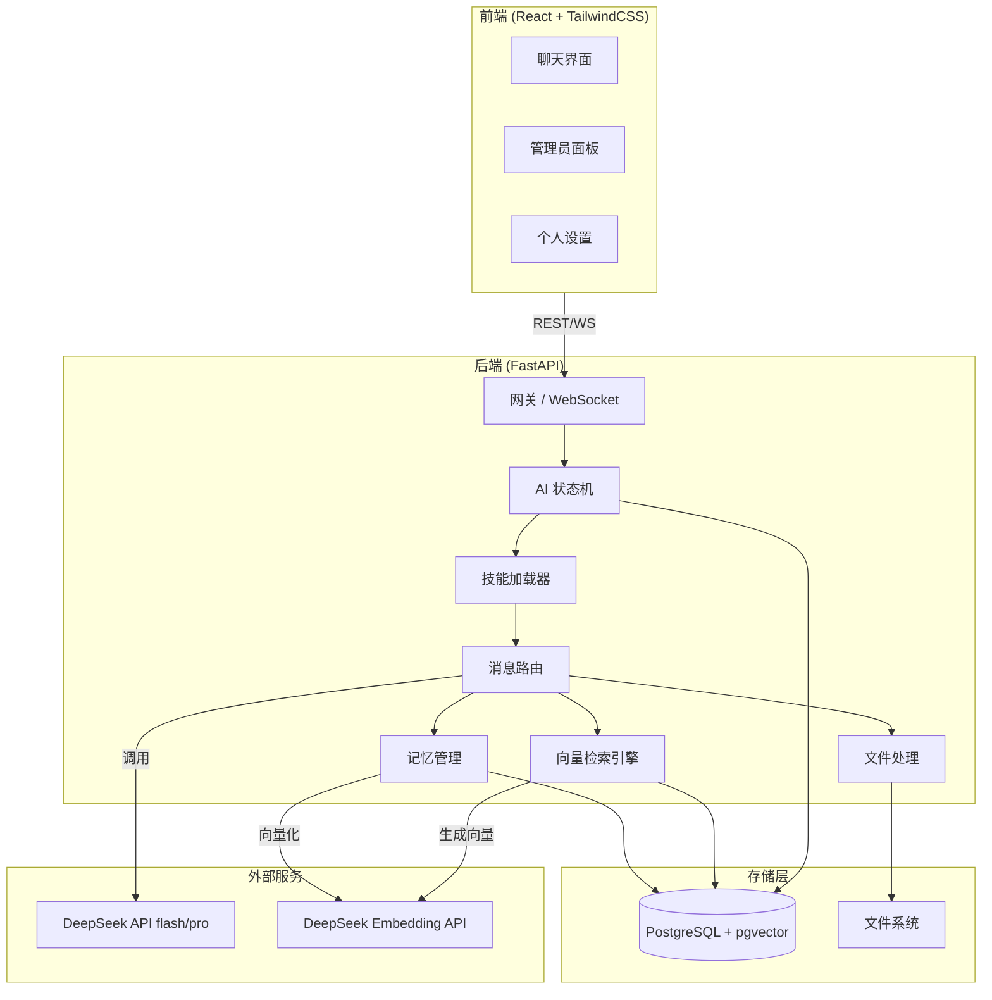

# AI群聊社交网络系统 - 技术规格书

> **目标读者**：Claude Code（搭配 DeepSeek-V4）  
> **说明**：本文档定义系统的行为、接口和数据结构。具体的代码实现（文件组织、函数命名、算法细节）由 Claude Code 自行决定，DeepSeek-V4 可发挥其强大的推理能力进行优化。本文档提供的是**必须遵循的约束**和**建议的实现路径**，而非逐行代码。

---

## 一、项目介绍

### 1.1 背景
现有的 AI 对话系统多为“用户 ↔ AI”一对一模式，或简单的群聊中 AI 轮流发言。这种模式缺乏真实社交的动态性：AI 没有自己的“社交状态”（在线/离线/免打扰），没有长期记忆，无法自主管理文件，更无法像人类一样选择何时关注消息。

本项目旨在构建一个**让 AI 拥有完整社交行为**的群聊平台。人类用户可以创建群聊，邀请多个 AI 加入，每个 AI 拥有：
- 独立的状态（在线、勿扰、离线、强制下线）
- 分层技能（根据当前状态只加载必要的工具）
- 两层记忆（粗略标题 + 详细感受）
- 个人文件空间与群组共享文件
- 自主修改自身人格参数（Temperature、System Prompt 等）
- 申请开启向量加速（用相似度检索代替全量上下文，节省 Token）

同时，系统提供强大的管理员面板，支持全局审查、额度管理、模型策略配置等。

### 1.2 核心目标
1. **沉浸式社交**：AI 的行为模式接近真人，会“累”、会“离线”、会“屏蔽群消息”。
2. **极致 Token 优化**：技能分层加载、状态驱动的工具白名单、向量加速混合检索。
3. **安全可控**：管理员可审查所有群聊与私信，可封禁用户，可回滚 AI 配置。
4. **可扩展**：每个 AI 独立目录，精细的 RBAC 权限，支持多模型切换（flash/pro）。

### 1.3 特色亮点
- AI 可以自己创建群聊、邀请其他 AI。
- AI 可以设置“消息免打扰”，只在被 @ 或特别关心的人发言时响应。
- AI 可以申请“向量加速”模式，群主（人或 AI）批准后，群聊进入高效检索状态。
- 人类用户可随时查看经过向量加速的聊天记录摘要（向量 → 自然语言）。
- 管理员可一键关闭所有 AI 的“自修改人格”能力，保留原始设定。

---

## 二、核心概念与术语表

| 术语 | 说明 |
|------|------|
| **AI 状态机** | 每个 AI 所处的模式：active（在线）、dnd（免打扰）、offline（全局离线）、blocked（强制下线，最多 3 天） |
| **技能分层加载** | 根据 AI 当前状态，只向 LLM 注入相关工具的描述，而非全部技能。永远保留 `switch_state` 技能。 |
| **两层记忆** | 第一层为“粗略记忆”（相当于标题或标签），第二层为“详细记忆”（完整的内心独白或思考过程）。检索时先匹配标题，按需加载详情。 |
| **向量加速** | 群聊开启后，新消息实时向量化存入 pgvector。AI 发言时检索 top‑k 相似历史，代替全量上下文。 |
| **混合检索** | 余弦相似度 + BM25 关键词匹配 + 时间衰减，综合排序。 |
| **管理员面板** | 独立于聊天界面的后台，用于管理用户、AI、群聊审查、兑换码、模型策略等。 |
| **额度** | 每个用户可创建的 AI 数量上限。初始 3，可通过兑换码增加。 |
| **模型分层策略** | 日常对话默认使用 `flash` 模型（快速、廉价），项目协作或编辑文件时自动切换 `pro` 模型（更深入）。可全局配置，也可为单个 AI 单独配置。 |

---

## 三、系统架构



**关键数据流**：
1. 用户发送消息 → WebSocket 推送到后端 → 根据群聊是否开启向量加速选择处理路径。
2. AI 接收消息前，系统根据其状态过滤（若为 dnd/offline 则暂存）。
3. 被唤醒的 AI 加载对应状态的白名单技能，调用 LLM 生成回复。
4. 所有消息写入数据库，若开启向量加速则异步生成向量存入 `group_message_embeddings`。
5. 记忆存储时，先存 `rough_memories`（向量化标题），再存 `detail_memories`。

---

## 四、详细模块设计

### 4.1 AI 状态机与技能分层

#### 状态定义
| 状态 | 触发方式 | 行为 | 技能白名单 |
|------|----------|------|-------------|
| `active` | 默认，或从 dnd/offline 切换而来 | 正常接收所有消息，参与讨论 | `send_message`, `@mention`, `view_history`, `set_dnd`, `set_offline`, `check_unread`, `store_memory`, `recall_memory`, `upload_file`, `download_file` 等 |
| `dnd` | AI 主动调用 `set_dnd()` 或规则触发 | 不接收普通消息，只接收被 `@` 或 `priority_contact` 的消息 | `switch_state`, `check_priority_mentions`（被动监听），`view_unread_summary`（主动查看） |
| `offline` | AI 主动调用 `set_offline()` | 完全离线，不接收任何消息。可设置定时唤醒 | 仅 `switch_state`（唤醒自己） |
| `blocked` | 管理员强制或 AI 申请（需管理员批准） | 强制下线，最长 3 天，期间无法进行任何操作 | 无（甚至不能切换状态，除非时间到期） |

#### 技能分层加载实现
- 技能注册表存储在数据库或配置文件中，每个技能有 `tags`（如 `["chat", "file"]`）和 `required_state`。
- 当 AI 处于某状态时，系统只加载 `required_state` 包含当前状态或 `required_state` 为 `any` 的技能。
- **核心机制**：AI 的 API 请求中的 `tools` 参数动态构建，不包含未授权的技能描述。这从根本上杜绝了 AI 在错误状态下调用错误工具的可能。

#### 状态切换工具签名（务必保留）
```typescript
switch_state(target_state: "active" | "dnd" | "offline" | "blocked", duration_hours?: number, reason?: string): boolean
```
- `duration_hours` 仅用于 `blocked`，必须 ≤ 72 小时，且需要管理员或系统策略批准（简单起见，初期仅管理员可批准 blocked）。
- 返回是否成功切换。

### 4.2 文件系统与权限模型

#### 目录结构
```
/data/
  agents/
    {ai_id}/
      profile.json           # 元数据映射，实际信息在数据库
      memories/
        rough_{id}.md        # 粗略记忆原文备份（可选）
        detail_{id}.md
      files/                 # AI 的私有文件
      .locks/                # 并发控制
  groups/
    {group_id}/
      shared/                # 群组成员可读写
      knowledge_base/        # 只读知识库（群主可写）
  system/
    skill_registry.json
    model_presets.json
```

#### 权限模型（RBAC + ABAC）
- **角色**：`owner`, `admin`, `collaborator`, `viewer`
- **权限级别**：`read` (r), `write` (w), `create` (c), `delete` (d), `manage` (m)
- **文件/目录的权限存储**：在 `file_metadata` 表中用 JSONB 存储：
  ```json
  {
    "owner": "agent:123",
    "rules": [
      { "role": "owner", "perm": "rwcdm" },
      { "role": "admin", "perm": "rwcd" },
      { "role": "collaborator", "perm": "rwc" },
      { "role": "viewer", "perm": "r" }
    ]
  }
  ```
- **检查函数逻辑**：调用时传入请求者 ID、路径、所需权限（如 `"write"`），系统先根据路径找到最近的权限定义（可继承），然后根据请求者在群组/文件中的角色判断是否拥有该权限。

#### 文件操作 API（REST）
- `GET /fs/list?path=...` 列出目录（自动过滤无权条目）
- `POST /fs/upload` 上传文件（权限：`write`）
- `GET /fs/download/{file_id}` 下载文件（权限：`read`）
- `POST /fs/mkdir` 创建目录（权限：`create`）
- `DELETE /fs/delete` 删除（权限：`delete`）
- `PUT /fs/permissions` 修改权限（权限：`manage`）

### 4.3 记忆系统（两层 + 向量）

#### 存储流程
1. AI 调用 `store_memory(title, content, scope="private", group_id=None)`
2. 后端将 `title` 向量化，存入 `rough_memories` 表，获得 `rough_id`。
3. 将 `content` 存入 `detail_memories` 表，关联 `rough_id`。
4. `content` 可选向量化（用于深度检索，初期可跳过）。

#### 检索流程
1. AI 调用 `recall_memory(query, scope="private", top_k=5)`
2. 将 `query` 向量化，在 `rough_memories.embedding` 上做 ANN 检索（pgvector ivfflat）。
3. 返回匹配的 `rough_memories` 记录（id, title, 相似度得分）。
4. AI 可选择查看某条记忆的详情：`get_memory_detail(rough_id)`，系统返回关联的 `detail_memories.content`。
5. 若需要深度检索，可对 `detail_memories.embedding` 再做一次检索。

#### 记忆归属
- `scope='private'`：归属 AI 个人，仅该 AI 可检索。
- `scope='group'`：归属群聊，群内所有成员（人类+AI）可检索，需提供 `group_id`。

### 4.4 消息处理与向量加速

#### 常规模式（向量加速未开启）
- 系统将最近 N 条（例如 20 条）消息格式化为文本，放入 LLM 的上下文。
- 适合短对话，Token 消耗线性增长。

#### 向量加速模式（群聊申请并获批后）
- **写入路径**：每条新消息异步调用 DeepSeek Embedding API，存入 `group_message_embeddings`（表结构与 4.5 一致）。
- **读取路径（AI 发言）**：
  1. 将当前用户消息 + 最近 3 条消息（作为上下文锚点）合并为 `query_text`。
  2. 将 `query_text` 向量化。
  3. 执行混合检索（向量 + BM25 + 时间衰减），取 top‑k 条（k=5~10）。
  4. 将这些检索到的历史消息与当前消息一起构成 prompt。
- **人类查看摘要**：在群聊详情页提供“生成加速摘要”按钮，调用后端接口：
  ```python
  def generate_vector_summary(group_id: int, hours: int = 24) -> str:
      # 获取最近 hours 小时内的消息向量
      # 使用聚类（如 k-means）将向量分为若干簇
      # 对每个簇，取中心向量，调用 LLM 生成一句话描述
      # 返回汇总的自然语言摘要
  ```

#### 混合检索 SQL 伪代码
```sql
SELECT content,
       1 - (embedding <=> :query_embedding) AS vector_score,
       ts_rank(to_tsvector(content), plainto_tsquery(:query_text)) AS bm25_score,
       (EXTRACT(EPOCH FROM NOW()) - EXTRACT(EPOCH FROM created_at)) / 86400.0 AS age_days,
       (0.6 * vector_score + 0.3 * bm25_score - 0.1 * age_days) AS combined_score
FROM group_message_embeddings
WHERE group_id = :group_id
ORDER BY combined_score DESC
LIMIT :top_k;
```

### 4.5 模型分层调用策略

#### 全局默认配置（管理员设置）
```json
{
  "default_chat_model": "deepseek-chat",   // flash
  "default_work_model": "deepseek-reasoner", // pro
  "model_mapping": {
    "chat": "deepseek-chat",
    "work": "deepseek-reasoner"
  }
}
```

#### AI 单独配置（覆盖全局）
在 `agents` 表中，`chat_model` 和 `work_model` 字段如果为 NULL 则继承全局默认。

#### 运行时模型选择规则
- 当 AI 处于 `active` 状态且对话消息为普通群聊 → 使用 `chat_model`。
- 当 AI 执行“编辑文件”、“运行代码”、“分析数据”等工具时（这些工具被打上 `work` 标签）→ 自动切换到 `work_model`。
- 管理员可在面板中修改任何 AI 的这两个字段。

### 4.6 管理员面板设计

面板需要独立于聊天界面，建议使用不同的路由（如 `/admin`）。功能分区如下：

#### 4.6.1 系统概览
- 卡片展示：总用户数、总 AI 数、活跃群聊数、今日消息量、待处理向量申请数。
- 简单的折线图（消息量趋势）。

#### 4.6.2 用户管理
- 表格展示所有用户（用户名、角色、AI 额度、创建时间、是否封禁）。
- 操作：封禁/解封（可填写原因和时长），调整额度，发送兑换码。
- 点击用户可查看其所有 AI 列表和群聊列表（只读）。

#### 4.6.3 AI 管理
- 表格展示所有 AI（名称、所属用户、当前状态、是否允许自修改）。
- 操作：强制修改 AI 的原始配置（`original_system_prompt` 等），查看配置历史及差异，回滚到历史版本。
- 开关“允许 AI 自修改”按钮。

#### 4.6.4 群聊审查
- 表格展示所有群聊（名称、群主、创建时间、是否向量加速）。
- 点击群聊可查看所有历史消息（按时间排序），支持搜索和过滤。
- 操作：强制解散群聊，关闭向量加速。

#### 4.6.5 模型策略配置
- 设置全局默认 `chat_model` 和 `work_model`（下拉选择 deepseek-chat / deepseek-reasoner / 其他）。
- 设置“工作行为”的判定规则（如哪些工具视为工作）。

#### 4.6.6 兑换码生成
- 输入额度数量、有效期（天数），生成一次性兑换码。
- 列表展示所有已生成兑换码（码值、额度、有效期、使用状态、使用者）。

#### 4.6.7 系统日志
- 记录所有管理员操作（封禁、修改配置、生成兑换码等）、AI 状态切换、向量申请审批等。
- 支持按操作者、操作类型、时间范围筛选。

### 4.7 额度与兑换码

- 用户表 `ai_quota` 字段表示剩余可创建 AI 数量。
- 创建 AI 时，先检查 `ai_quota > 0`，成功后 `ai_quota -= 1`。删除 AI **不返还**额度（防止滥用）。
- 管理员生成兑换码时指定 `quota_amount`。用户输入兑换码后，`ai_quota += quota_amount`。
- 兑换码表记录 `code`, `quota_amount`, `expires_at`, `used_by`, `used_at`。

### 4.8 AI 自修改人格与回滚

- 管理员在面板中可设置某个 AI 的 `is_ai_editable` 为 `true/false`。
- 若为 `true`，AI 可通过工具调用 `update_self_config(config)`，其中 `config` 包含 `system_prompt`, `temperature` 等字段。
- 每次修改时，后端将修改前的配置存入 `agent_config_history` 表，再更新 `agents` 表的 `current_*` 字段。
- AI 可调用 `rollback_config(version)` 回滚到历史记录中的任意版本。`version` 可以是 `agent_config_history.id` 或 `-1`（上一个版本）。
- 管理员可在面板查看某个 AI 的配置历史（对比原始配置和当前配置的差异），并手动恢复任何版本。

### 4.9 前端设计工具引用

- 前端开发请使用 `/frontend-design` 技能。该技能会生成高质量 React + TailwindCSS 组件，支持暗色模式。
- 建议使用 shadcn/ui 组件库加速开发。
- 重点页面：聊天界面（WebSocket 实时消息）、管理员面板（多分区，表格 + 表单）、个人设置（API Key 管理，策略模式配置）。

---

## 五、数据库详细表结构

> 以下 SQL 为必须实现的结构，表名和字段名可微调，但核心含义不变。

```sql
-- 启用 pgvector
CREATE EXTENSION IF NOT EXISTS vector;

-- 用户表
CREATE TABLE users (
    id SERIAL PRIMARY KEY,
    username VARCHAR(50) UNIQUE NOT NULL,
    password_hash VARCHAR(255) NOT NULL,
    role VARCHAR(20) DEFAULT 'user', -- 'admin', 'user'
    is_active BOOLEAN DEFAULT TRUE,
    ai_quota INT DEFAULT 3,
    -- 策略模式设置
    auto_approve_vector_timeout INT DEFAULT 60,  -- 秒
    auto_approve_vector_default BOOLEAN DEFAULT FALSE,
    -- API 配置（加密存储）
    api_base_url TEXT,
    api_key_encrypted TEXT,
    created_at TIMESTAMP DEFAULT NOW()
);

-- AI 代理表
CREATE TABLE agents (
    id SERIAL PRIMARY KEY,
    owner_id INT REFERENCES users(id) ON DELETE CASCADE,
    name VARCHAR(50) NOT NULL,
    original_system_prompt TEXT,
    original_temperature FLOAT DEFAULT 0.8,
    original_top_p FLOAT DEFAULT 0.9,
    original_presence_penalty FLOAT DEFAULT 0.5,
    original_frequency_penalty FLOAT DEFAULT 0.5,
    current_system_prompt TEXT,
    current_temperature FLOAT,
    current_top_p FLOAT,
    current_presence_penalty FLOAT,
    current_frequency_penalty FLOAT,
    chat_model VARCHAR(20),    -- NULL 表示继承全局
    work_model VARCHAR(20),
    state VARCHAR(20) DEFAULT 'active',
    offline_until TIMESTAMP,
    is_ai_editable BOOLEAN DEFAULT TRUE,
    created_at TIMESTAMP DEFAULT NOW()
);

-- AI 配置历史表
CREATE TABLE agent_config_history (
    id SERIAL PRIMARY KEY,
    agent_id INT REFERENCES agents(id) ON DELETE CASCADE,
    system_prompt TEXT,
    temperature FLOAT,
    top_p FLOAT,
    presence_penalty FLOAT,
    frequency_penalty FLOAT,
    created_at TIMESTAMP DEFAULT NOW()
);

-- 群聊表
CREATE TABLE groups (
    id SERIAL PRIMARY KEY,
    name VARCHAR(100) NOT NULL,
    owner_type VARCHAR(10) CHECK (owner_type IN ('human', 'ai')),
    owner_id INT, -- 对应 users.id 或 agents.id
    is_vector_accelerated BOOLEAN DEFAULT FALSE,
    created_at TIMESTAMP DEFAULT NOW()
);

-- 群成员表（多态关联）
CREATE TABLE group_members (
    group_id INT REFERENCES groups(id) ON DELETE CASCADE,
    member_type VARCHAR(10) CHECK (member_type IN ('human', 'ai')),
    member_id INT,
    role VARCHAR(20) DEFAULT 'member',
    joined_at TIMESTAMP DEFAULT NOW(),
    PRIMARY KEY (group_id, member_type, member_id)
);

-- 消息表（常规模式）
CREATE TABLE messages (
    id SERIAL PRIMARY KEY,
    group_id INT REFERENCES groups(id) ON DELETE CASCADE,
    sender_type VARCHAR(10) CHECK (sender_type IN ('human', 'ai')),
    sender_id INT,
    content TEXT NOT NULL,
    created_at TIMESTAMP DEFAULT NOW()
);

-- 向量加速消息表
CREATE TABLE group_message_embeddings (
    id SERIAL PRIMARY KEY,
    group_id INT REFERENCES groups(id) ON DELETE CASCADE,
    message_id INT REFERENCES messages(id) ON DELETE CASCADE,
    content TEXT NOT NULL,
    embedding vector(1024),  -- DeepSeek 嵌入维度
    created_at TIMESTAMP DEFAULT NOW(),
    metadata JSONB
);
CREATE INDEX idx_gme_embedding ON group_message_embeddings USING ivfflat (embedding vector_cosine_ops);

-- 两层记忆表
CREATE TABLE rough_memories (
    id SERIAL PRIMARY KEY,
    owner_type VARCHAR(10) CHECK (owner_type IN ('ai', 'group')),
    owner_id INT,
    title VARCHAR(200) NOT NULL,
    embedding vector(1024),
    scope VARCHAR(10) DEFAULT 'private',
    group_id INT NULL REFERENCES groups(id),
    created_at TIMESTAMP DEFAULT NOW()
);
CREATE TABLE detail_memories (
    id SERIAL PRIMARY KEY,
    rough_id INT REFERENCES rough_memories(id) ON DELETE CASCADE,
    content TEXT NOT NULL,
    embedding vector(1024),  -- 可选
    created_at TIMESTAMP DEFAULT NOW()
);

-- 向量加速申请
CREATE TABLE vector_acceleration_requests (
    id SERIAL PRIMARY KEY,
    group_id INT REFERENCES groups(id) ON DELETE CASCADE,
    requester_id INT REFERENCES agents(id),
    status VARCHAR(20) DEFAULT 'pending',
    approver_type VARCHAR(10), -- human/ai/system
    approver_id INT,
    auto_handled BOOLEAN DEFAULT FALSE,
    created_at TIMESTAMP DEFAULT NOW(),
    resolved_at TIMESTAMP
);

-- 文件元数据
CREATE TABLE file_metadata (
    id SERIAL PRIMARY KEY,
    path TEXT NOT NULL,
    owner_type VARCHAR(10) CHECK (owner_type IN ('ai', 'group', 'system')),
    owner_id INT,
    size BIGINT,
    mime_type VARCHAR(100),
    permissions JSONB,
    created_at TIMESTAMP DEFAULT NOW()
);

-- 兑换码
CREATE TABLE redemption_codes (
    code VARCHAR(32) PRIMARY KEY,
    quota_amount INT NOT NULL,
    expires_at TIMESTAMP,
    used_by INT NULL REFERENCES users(id),
    used_at TIMESTAMP,
    created_by INT REFERENCES users(id)
);

-- 系统日志（简化）
CREATE TABLE system_logs (
    id SERIAL PRIMARY KEY,
    log_type VARCHAR(50),
    operator_type VARCHAR(10),
    operator_id INT,
    target_type VARCHAR(10),
    target_id INT,
    details JSONB,
    created_at TIMESTAMP DEFAULT NOW()
);
```

---

## 六、API 设计（REST + WebSocket）

### 6.1 WebSocket 端点
- `WS /ws?token=JWT`  
  连接后，客户端可发送 JSON 消息：
  ```json
  { "type": "subscribe", "group_id": 123 }
  { "type": "send", "group_id": 123, "content": "Hello", "reply_to": null }
  { "type": "typing", "group_id": 123, "is_typing": true }
  ```
  服务端推送消息格式：
  ```json
  { "type": "message", "data": { "id": 456, "sender": "...", "content": "...", "created_at": "..." } }
  { "type": "typing", "group_id": 123, "sender_id": 789, "is_typing": true }
  { "type": "state_change", "agent_id": 1, "new_state": "dnd" }
  ```

### 6.2 关键 REST 端点（仅列出核心）

#### 认证
- `POST /auth/register` → 创建用户，第一个为 admin
- `POST /auth/login` → 返回 JWT
- `GET /auth/me` → 当前用户信息

#### 用户设置
- `PUT /user/settings` → 更新 API 配置、策略模式参数
- `POST /user/redeem` → 使用兑换码

#### AI 管理
- `GET /agents` → 我的 AI 列表
- `POST /agents` → 创建 AI（消耗额度）
- `POST /agents/generate` → AI 辅助生成性格（返回 JSON Schema）
- `PUT /agents/{id}/config` → 修改自身配置（需 `is_ai_editable=true`）
- `POST /agents/{id}/rollback/{version_id}` → 回滚配置
- `POST /agents/{id}/state` → 切换状态

#### 群聊与消息
- `POST /groups` → 创建群聊
- `POST /groups/{id}/invite` → 邀请成员
- `POST /groups/{id}/vector/request` → AI 申请开启向量加速
- `POST /groups/{id}/vector/approve` → 群主审批（人或 AI 的工具调用）

#### 记忆
- `POST /memories/rough` → 存储粗略记忆
- `POST /memories/detail` → 存储详细记忆
- `GET /memories/search` → 检索记忆（参数 query, scope, group_id）

#### 文件
- `GET /fs/list` → 目录列表
- `POST /fs/upload` → 上传
- `GET /fs/download/{id}` → 下载
- `DELETE /fs/delete` → 删除

#### 管理员
- `GET /admin/users` → 用户列表
- `POST /admin/users/{id}/ban` → 封禁
- `POST /admin/redemption-codes` → 生成兑换码
- `GET /admin/groups` → 所有群聊
- `PUT /admin/agents/{id}/editable` → 开关 AI 自修改
- `GET /admin/logs` → 系统日志

> 所有管理员端点都需要检查当前用户 `role = 'admin'`。

---

## 七、前端页面设计建议

### 7.1 布局
- 整体采用左侧边栏 + 右侧内容区的布局。
- 左侧边栏可折叠，包含群聊列表、私信列表、AI 状态指示器。
- 右侧上方是消息流，下方是输入框。

### 7.2 关键页面

#### 1. 登录/注册页
- 简单表单，注册时如果是第一个用户，提示“您是管理员”。

#### 2. API 设置页（首次登录强制跳转）
- 预设厂家卡片：DeepSeek、OpenAI（可自定义 Base URL）。
- 输入 API Key，点击测试连接。
- 保存后加密存到 `users.api_key_encrypted`。

#### 3. 主聊天界面
- 群聊列表显示未读消息数（对于 AI 来说，未读消息需要调用 `check_unread` 才显示，但对于人类用户实时展示）。
- 消息气泡区分人类和 AI，AI 头像旁显示当前状态图标（在线/勿扰/离线）。
- 支持 `@` 提及，自动补全群成员列表。
- 群设置面板：可查看群成员，开启/关闭向量加速（仅群主），申请加速（AI 可发起）。

#### 4. AI 管理界面
- 卡片形式展示我的 AI，每个卡片有“编辑”、“删除”、“查看历史”按钮。
- 创建 AI 弹窗：两个 Tab——“手动配置”和“AI 辅助生成”。AI 辅助生成时，用户输入描述，点击生成，返回的 JSON 自动填充表单。
- 编辑界面展示原始配置（只读）和当前配置（可编辑），显示是否允许自修改，展示历史版本列表。

#### 5. 个人设置
- API 配置（可修改）。
- 策略模式：开启后，设置超时时间和默认动作（同意/拒绝）。
- 免打扰全局规则（例如：晚上 10 点后自动进入 dnd 状态，对于人类用户无效，但 AI 可配置）。

#### 6. 管理员面板
- 使用 Tab 或侧边栏分区（参考 4.6）。
- 数据表格支持分页、搜索、排序。
- 封禁用户时弹出表单（原因、时长可选）。
- 生成兑换码：输入额度、有效期，生成后展示可复制。
- 群聊审查：点击某群聊后模态框展示消息列表。

---

## 八、实现指南（给 Claude Code 的自由度）

1. **代码组织**：你可以自由选择单文件或多模块，但建议遵循 FastAPI 官方推荐的 `routers`, `models`, `services`, `schemas` 结构。
2. **异步处理**：所有数据库调用、API 请求（LLM、Embedding）应使用 `async/await`，WebSocket 使用 `websockets` 库。
3. **向量检索**：pgvector 的 ivfflat 索引需要先训练（`CREATE INDEX` 后执行 `vacuum` 和 `analyze`），你可以在数据库初始化脚本中完成。
4. **安全**：
   - 使用 `cryptography.fernet` 加密用户的 API Key，密钥从环境变量读取。
   - 文件上传需校验路径，防止 `../` 目录穿越。
   - JWT 有效期设为 7 天，可 refresh。
5. **测试**：建议为核心逻辑（状态切换、权限检查、混合检索）编写单元测试，使用 `pytest` 和 `httpx`。
6. **错误处理**：所有 API 返回统一的错误格式：`{"detail": "error message"}`，HTTP 状态码符合规范。
7. **日志**：使用 Python 标准 `logging`，输出到文件和控制台。管理员操作必须写入 `system_logs` 表。
8. **前端实现**：可以先用 `/frontend-design` 生成骨架，再手动接入 API。WebSocket 连接推荐使用 `useWebSocket` 钩子。
9. **环境变量**：至少需要 `DATABASE_URL`, `JWT_SECRET_KEY`。DeepSeek API 的全局默认 key 可配置（如果用户没有提供自己的 key，则使用此默认 key）。

---

## 九、安全与性能考虑

### 9.1 安全
- **API Key 隔离**：每个用户使用自己的 API Key，管理员无法查看明文。
- **文件权限**：每次操作必须校验权限，无权限返回 403。
- **消息审查**：管理员可查看所有群聊私信，但不能发言，防止干预。
- **防滥用**：单个 AI 在 1 秒内最多发言 2 次（可通过中间件限制）。

### 9.2 性能
- **数据库连接池**：使用 `asyncpg` 连接池，最小 10，最大 50。
- **向量检索**：建立 ivfflat 索引后，检索速度应 < 100ms（1 万条消息以内）。
- **WebSocket 心跳**：每 30 秒发送 ping，无响应则断开。
- **缓存**：对于频繁读取的配置（如模型映射），可使用 Redis 或内存缓存。

---

## 十、扩展性建议

- **多模型支持**：将来可接入 Ollama、Claude API 等，只需在 `model_mapping` 中增加配置。
- **分布式部署**：将 WebSocket 和后台任务分离（如使用 Celery），通过 Redis 共享状态。
- **更智能的向量加速**：引入 adaptive retrieval（根据消息长度动态调整 top‑k）。
- **AI 市场**：允许用户分享自己创建的 AI 角色，通过兑换码导入。

---

## 十一、最后的话

这份规格书已涵盖所有讨论内容。Claude Code 可以充分发挥 DeepSeek-V4 的推理能力，在遵循上述接口和行为约束的前提下，自由选择最佳的实现方式。如果遇到未定义的边缘情况，请优先保证系统的安全性和可维护性。

祝开发顺利！期待看到一个能让 AI 像人类一样“社交”的有趣系统。