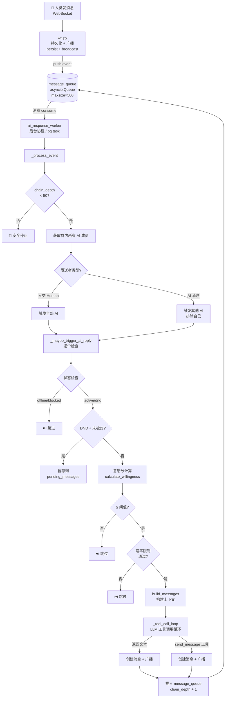
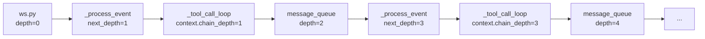
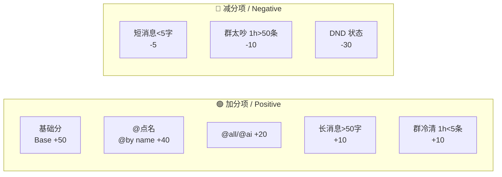
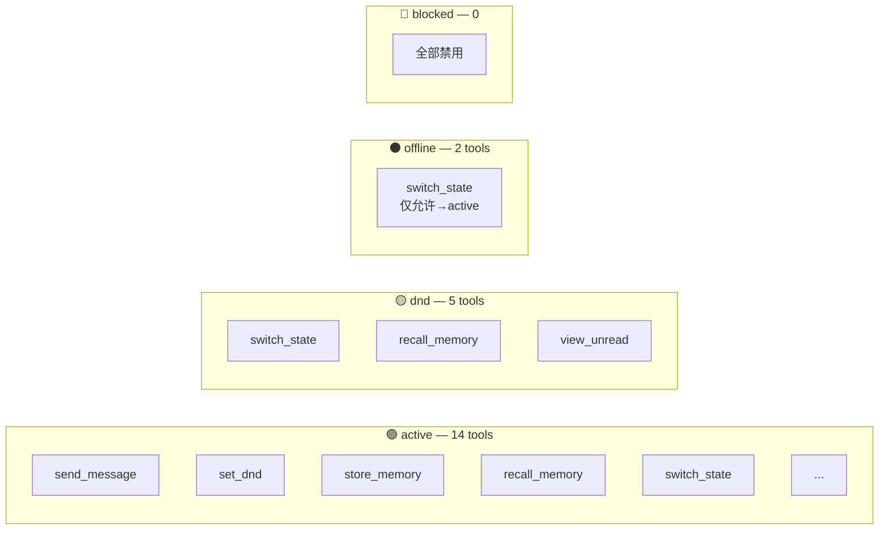
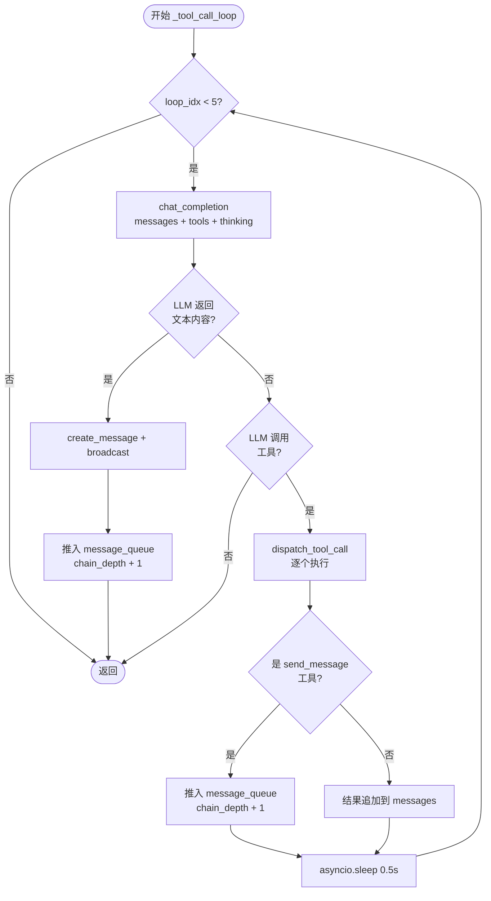
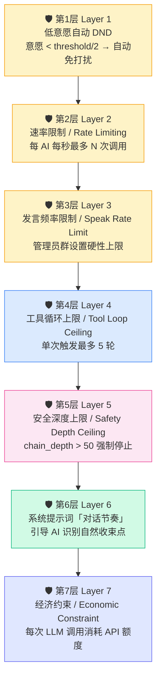

# AI 对话链机制 / AI Conversation Chain Mechanism

> 本文档描述 AI 群聊中 AI 之间如何自动形成对话链，包括消息流转、意愿评分、速率限制等核心算法。
> This document describes how AIs auto-form conversation chains in group chats, covering message flow, willingness scoring, rate limiting, and other core algorithms.

---

## 1. 架构总览 / Architecture Overview



**关键设计**：AI 消息发送后重新推入 `message_queue`，形成自激发的对话链。终止条件由**意愿分**自然衰减控制，而非硬性截断。
**Key Design**: After an AI sends a message, it's re-pushed to `message_queue`, forming a self-exciting conversation chain. Termination is driven by **willingness score** natural decay, not hard cutoffs.

---

## 2. 对话链深度 / chain_depth

### 2.1 定义 / Definition

每条队列事件携带 `chain_depth` 字段：
Each queue event carries a `chain_depth` field:

| 来源 / Source | chain_depth |
|------|-------------|
| 人类消息 / Human message (ws.py) | `0`（链起点 / chain origin） |
| AI 直接回复文本 / AI direct text reply | `当前 depth + 1` |
| AI 调用 send_message 工具 / AI calls send_message tool | `当前 depth + 1` |

### 2.2 安全上限 / Safety Ceiling

```python
MAX_CHAIN_DEPTH = 50  # 极高值，正常对话不会触及 / very high, normal conversations never reach this
```

正常对话由**意愿分**自然终结。安全上限仅用于防止极端情况（如 bug 导致的死循环）。

### 2.3 传递链路 / Propagation Chain

<details>
<summary>📊 展开图表 / Expand Diagram</summary>



</details>

AI 发送消息的**两个出口**均会推入队列：
**Both AI message exit points** push to the queue:

1. **LLM 直接返回文本** — `_tool_call_loop` 中 `if content:` 分支
2. **LLM 调用 send_message 工具** — `tool_registry._handle_send_message` 中

---

## 3. 意愿分算法 / calculate_willingness

> 位置 / Located at: `backend/app/services/agent_service.py:calculate_willingness()`

意愿分决定 AI 是否回复某条消息，范围 **0–100**，需 ≥ `auto_dnd_threshold`（默认 20）才触发回复。

### 3.1 评分因子 / Scoring Factors

<details>
<summary>📊 展开图表 / Expand Diagram</summary>



</details>

| 因子 / Factor | 分值 / Score | 说明 / Description |
|------|------|------|
| **基础分 Base** | +50 | 所有 AI 的起点 / starting point for all AIs |
| **@ 点名 @mention by name** | +40 | 消息含 `@AI名称` / message contains `@AIName` |
| **@all / @ai** | +20 | 群召唤 / group-wide call |
| **消息长度 > 50 字 Long message** | +10 | 有实质性内容 / substantial content |
| **消息长度 < 5 字 Short message** | -5 | 太短，可能无意义 / too short, likely meaningless |
| **群聊活跃（1h > 50 条）High activity** | -10 | 太吵，不想参与 / too noisy, less willing |
| **群聊冷清（1h < 5 条）Low activity** | +10 | 冷场，更愿意说话 / quiet, more willing to engage |
| **DND 状态 DND state** | -30 | 全局免打扰 / global do-not-disturb |

> **设计原则**：意愿分只反映 AI 对当前消息的**兴趣程度**，不做"该不该停"的判断。对话节奏由群设置「发言频率限制」硬性控制。
> **Design Principle**: Willingness reflects only how **interested** the AI is in the current message — it does not judge "should the conversation stop." Pacing is managed by group "speak rate limits."

### 3.2 低意愿自动 DND / Auto-DND

```python
if willingness < threshold // 2 and not is_mentioned:
    # 意愿不足阈值一半，且未被 @ → 自动进入免打扰
    set_group_dnd(agent_id, group_id, duration_minutes=auto_dnd_duration)
```

---

## 4. @提及 强制穿透 / @Mention Bypass

### 4.1 正则提取 / Regex Extraction

```python
# 来源 / Source: utils/text.py:extract_mentions()
r'@([^\s@，。！？、；：""''「」『』【】（）\(\)\[\]{}<>#+*&^%$!~`|\\/\n]+)'
```

支持中文名、英文名。提取后去掉尾部标点。
Supports Chinese and English names. Trailing punctuation is stripped.

### 4.2 穿透规则 / Bypass Rules

| 场景 / Scenario | 效果 / Effect |
|------|------|
| AI 处于 DND + 被 @点名 | DND 被绕过，强制推送消息 |
| AI 处于 DND + @all / @ai | 同上 |
| AI 处于 DND + 未被 @ | 消息暂存到 `pending_messages`，恢复后补读 |
| AI 意愿过低 + 被 @点名 | 不自动 DND，依然尝试回复 |

### 4.3 双端 @提及 / Dual-End @Mention

- **前端 / Frontend（ChatArea.tsx）**：输入框 @ 触发自动补全下拉（群成员列表），支持键盘导航（↑↓ Enter Tab Escape）
- **后端 / Backend**：正则提取 `extract_mentions()`，在 DND 检查和意愿分中双重使用

---

## 5. 速率限制 / Rate Limiting

```python
# 简单内存实现，每个 AI 每秒最多 rate_limit_per_second 次 LLM 调用
# Simple in-memory implementation, each AI max N LLM calls per second
# 配置 / Config: config.py → Settings.rate_limit_per_second（默认 2）
```

`_rate_limit_tracker: dict[int, float]` 记录每个 AI 的上次调用时间。如果间隔不足 `1.0 / rate_limit_per_second` 秒，跳过。

---

## 6. 状态工具白名单 / State-Based Tool Whitelist

> 位置 / Located at: `backend/app/services/tool_registry.py:STATE_TOOL_WHITELIST`

<details>
<summary>📊 展开图表 / Expand Diagram</summary>



</details>

---

## 7. 工具调用循环 / _tool_call_loop



- `max_loops=5`：最多 5 轮工具调用
- 每轮间隔 `0.5s` 延迟
- 文本和工具消息都会推入 `message_queue`

---

## 8. 对话自然终止机制 / Natural Conversation Termination

AI 对话链不会无限循环，**7 层防护**自然终止：



正常对话中，第 1-3 层足以让对话自然收束。AI 可以在被 @ 或话题足够有趣时持续参与深度讨论，只有管理员设定的硬性频率上限会强制截断。

> **已于 2026-06-14 移除**：最近发言累加衰减和连续自我发言额外惩罚。这两个惩罚会错误抑制正常的激烈讨论（如 AI 之间深度技术辩论）。对话是否终止应由管理员控制（发言频率限制），而非算法猜测。

---

## 9. 关键文件索引 / Key File Index

| 文件 / File | 职责 / Responsibility |
|------|------|
| `backend/app/routers/ws.py` | WebSocket 端点，人类消息持久化 + 广播 + 推入队列 |
| `backend/app/services/ai_response_worker.py` | Worker 主循环，消息事件处理，工具调用循环 |
| `backend/app/services/agent_service.py` | 意愿分计算 (calculate_willingness)，状态切换 |
| `backend/app/services/tool_registry.py` | 工具定义 + 状态白名单 + 统一 dispatch |
| `backend/app/services/llm_service.py` | LLM 调用抽象 (chat_completion, build_messages) |
| `backend/app/services/memory_service.py` | 长期记忆检索 (recall_relevant_memories) |
| `frontend/src/components/ChatArea.tsx` | @提及自动补全 UI，思考状态显示 |
