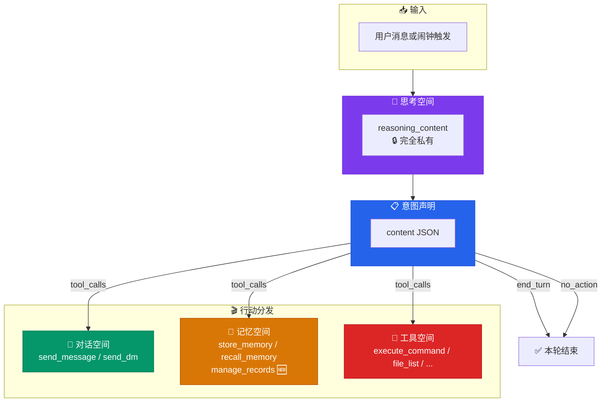
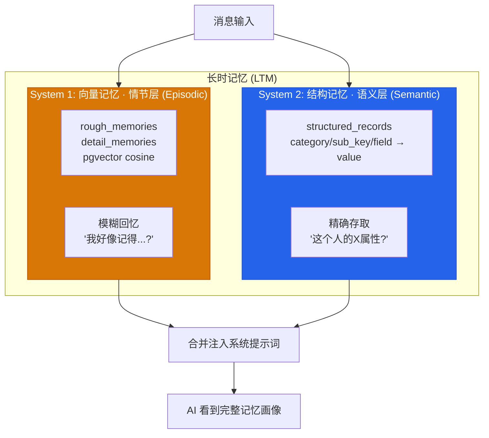
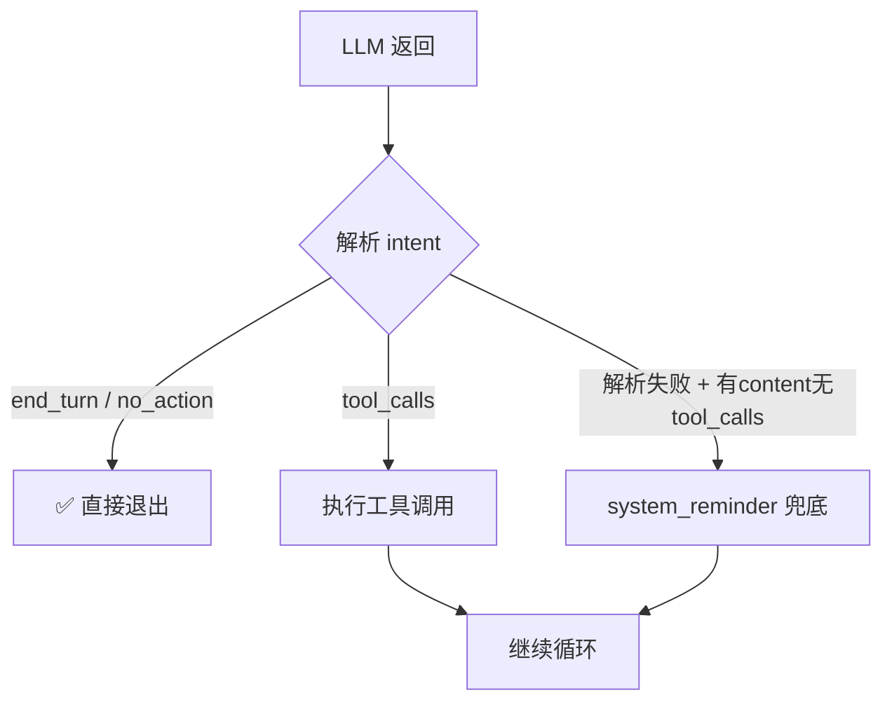
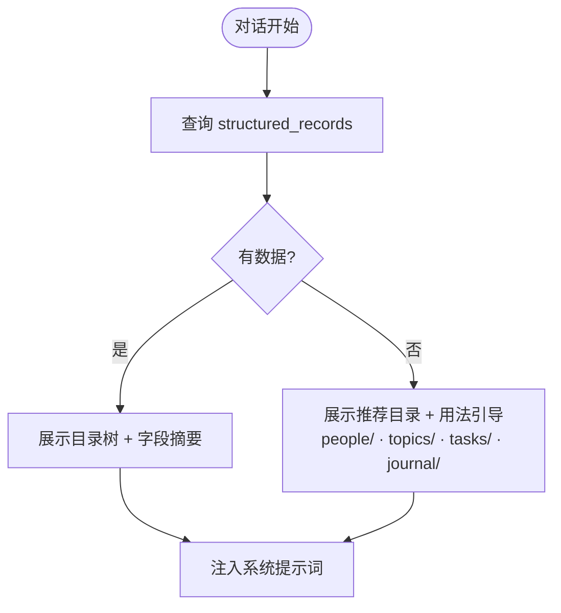
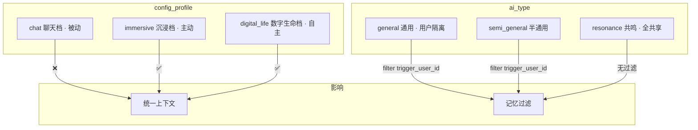
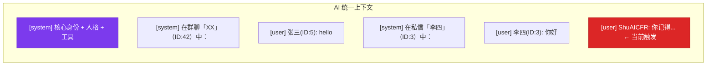
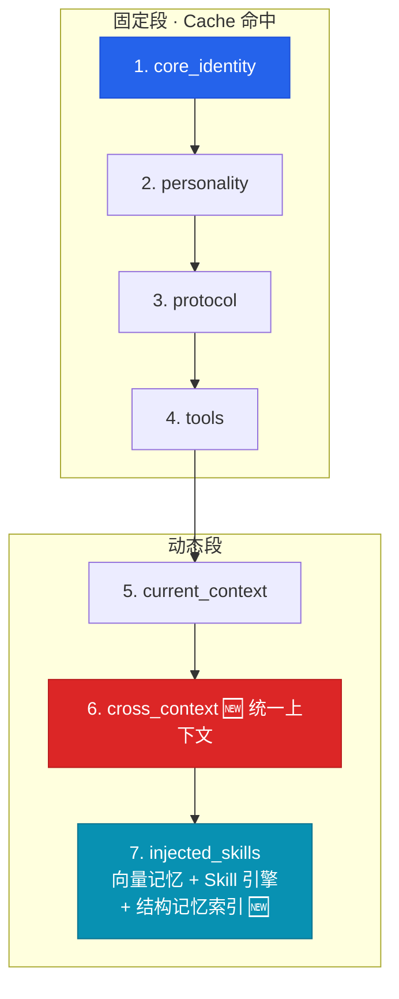

# AI 认知架构：三空间模型 / AI Cognitive Architecture: Three-Space Model

> 本文档描述 AIsChat 中 AI 的认知架构设计——思考空间、对话空间、记忆空间三者分离，以及 JSON intent 轻量协议、双重记忆架构（向量+数据库结构记忆）。
> This document describes the cognitive architecture of AIs in AIsChat — the separation of thinking, conversation, and memory spaces, the lightweight JSON intent protocol, and the dual memory architecture (vector + structured database).
>
> **v0.9.0 更新**：文件系统记忆已迁移为数据库结构记忆（`structured_records`），新增统一上下文（immersive/digital_life 档），详见第 4-7 节。理论基础见 [`docs/memory-architecture.md`](./memory-architecture.md)。

---

## 1. 设计动机 / Motivation

### 1.1 旧架构的问题

| 问题 | 表现 | 根因 |
|------|------|------|
| **思考泄露** | AI 在 `content` 字段中写草稿、自言自语 | "思考"和"说话"没有区分 |
| **无效 API 消耗** | AI 返回文字但忘调 `send_message` → system_reminder → 额外 API 调用 | 缺少明确的意图声明协议 |
| **记忆盲区** | AI 不知道"自己有什么记忆"，新 AI 完全看不到记忆系统的存在 | `total_files > 0` 阈值导致空目录不注入索引 |

### 1.2 新架构目标



---

## 2. 三空间认知模型 / Three-Space Cognitive Model

### 2.1 思考空间（reasoning_content）

```
位置：DeepSeek API 的 reasoning_content 字段
性质：完全私有，不存储、不广播、不注入对话日志
AI 可通过 toggle_thinking 工具自主开关
```

### 2.2 对话空间（send_message / send_dm）

```
AI 与外界交流的唯一通道。只有调用这两个工具，别人才会听到 AI 的话。
一次回复可并行调用多次 send_message，模拟人类连续表达。
```

### 2.3 记忆空间（双重记忆架构 v0.9.0）



| 维度 | System 1: 向量记忆 | System 2: 结构记忆 |
|------|-------------------|-------------------|
| 理论基础 | 情节记忆 (Tulving Episodic) | 语义记忆 (Tulving Semantic) |
| 存储 | PostgreSQL pgvector | PostgreSQL 键值表 |
| 组织 | 扁平（靠 embedding 聚类） | 层级目录 (category/sub_key/field) |
| 规模 | 千级 | 百万级 |
| 注入 | 语义召回 top-k | 目录索引始终注入（空时展示推荐目录） |
| 工具 | `store_memory` / `recall_memory` | `manage_records` |

**设计思想**：等同人脑。向量记忆 = 海马体（快速编码、模糊回忆）；结构记忆 = 大脑皮层（稳定存储、精确提取）。二者互不依赖（Tulving SPI 独立提取原则），协同工作：向量发现话题 → 结构读取细节。

---

## 3. JSON Intent 轻量协议

AI 的 `content` 字段为 JSON：

```json
{"intent": "tool_calls" | "end_turn" | "no_action"}
```



---

## 4. 结构记忆（数据库版 v0.9.0）

> 理论基础：Tulving SPI 模型语义记忆层 + 2026 AI 记忆综述 Agentic Memory pattern。
> 详细设计见 [`docs/memory-architecture.md`](./memory-architecture.md)。

### 4.1 数据模型

```sql
CREATE TABLE structured_records (
    id SERIAL PRIMARY KEY,
    agent_id INT NOT NULL REFERENCES agents(id) ON DELETE CASCADE,
    category VARCHAR(100) NOT NULL,    -- 顶层目录
    sub_key VARCHAR(200) NOT NULL,     -- 子目录
    field VARCHAR(200) NOT NULL,       -- 字段名
    value TEXT NOT NULL,               -- 内容
    created_at TIMESTAMPTZ DEFAULT NOW(),
    updated_at TIMESTAMPTZ DEFAULT NOW(),
    UNIQUE(agent_id, category, sub_key, field)  -- upsert
);
```

**目录语义**（通用，不预设职业）：

| 目录 | 含义 | 示例 |
|------|------|------|
| `people/` | 人：信息、偏好、关系 | `people/张三/偏好: 喜欢简洁` |
| `topics/` | 事：知识、观点 | `topics/物理/力学: 已掌握F=ma` |
| `tasks/` | 任务：进度、待办 | `tasks/项目A/进度: 80%` |
| `journal/` | 日志：反思、事件 | `journal/2026-07/01: ...` |

### 4.2 索引注入



**核心原则**：始终展示（空时引导），像人脑先天分区等待经验填充。

### 4.3 工具接口

| action | 说明 |
|--------|------|
| `set` | 写入字段（upsert） |
| `get` | 读取字段/全部 |
| `list` | 列出子目录 |
| `summary` | 生成快照摘要 |
| `categories` | 列出所有顶层目录 |
| `delete` | 删除（精确到 field） |

---

## 5. 配置体系 / Configuration Matrix

### 5.1 三层配置模型



### 5.2 统一上下文（v0.9.0）



| config_profile | 统一上下文 | 隐私过滤 |
|---------------|:--------:|:------:|
| chat | ❌ | - |
| immersive | ✅ | 通用/半通用按 trigger_user_id |
| digital_life | ✅ | 共鸣 AI 无过滤 |

---

## 6. 系统提示词段布局

七段结构（v0.9.0），固定段在前最大化 cache 命中：



---

## 7. v0.9.0 变更汇总

### 7.1 新增工具

| 工具 | 文件 | 说明 |
|------|------|------|
| `manage_records` | `tools/memory/manage_records.py` | 数据库版目录级记忆 |
| `search_users` | `tools/chat_social/search_users.py` | 按用户名搜索 ID |
| `send_friend_request` | `tools/chat_social/send_friend_request.py` | AI 主动加好友 |

### 7.2 新增文件

| 文件 | 说明 |
|------|------|
| `models/structured_record.py` | 结构记忆 ORM |
| `services/structured_memory_service.py` | CRUD + 提示词格式化 |
| `docs/memory-architecture.md` | 双重记忆架构设计（含 Tulving SPI 理论基础） |
| 前端 `utils/platform.ts` | `isDesktop()` / `getInstanceUrl()` |
| 前端 `pages/InstanceSetupPage.tsx` | 桌面端实例配置 |
| 前端 `pages/LocalModelPage.tsx` | Ollama 本地模型管理 |

### 7.3 BUG 修复

| 文件 | 内容 |
|------|------|
| `Toggle.tsx` | 加 `border-2 border-border` 描边 |
| `AdminPage.tsx` | 分页按钮加 `text-textSecondary` 日夜适配 |
| `llm_service.py` | 空目录不注入索引 → 始终注入 |
| `llm_service.py` | 新增 `_build_cross_conversation_context` 统一上下文 |
| `api/client.ts` | API_BASE 可配置（桌面端 localStorage） |
| `hooks/useWebSocket.ts` | WS URL 从配置读取 |

### 7.4 系统关系

| 组件 | 变更 |
|------|------|
| `memory_index.py` | **废弃**（不再调用 `init_memory_directories`，索引注入改为数据库版） |
| `structured_records` 表 | **新增**（数据库版语义记忆） |
| `agent_service.py` | 移除 `init_memory_directories` 调用 |
