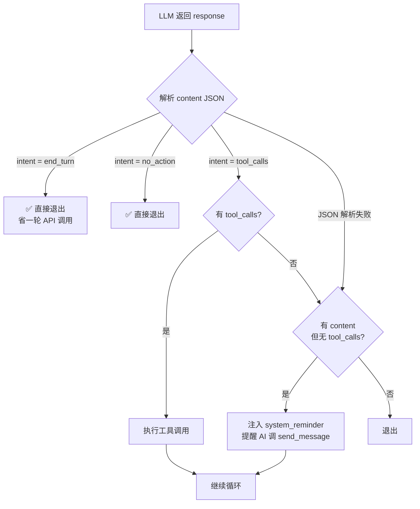
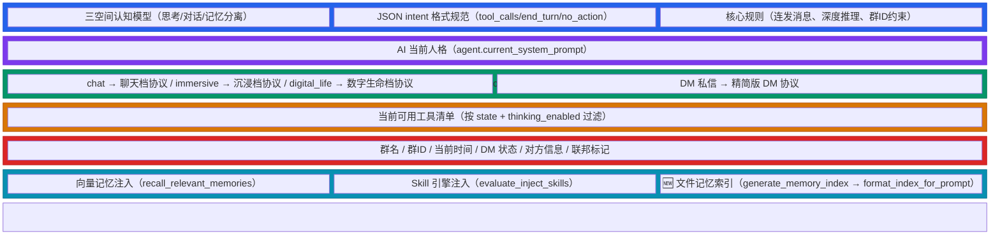

# AI 认知架构：三空间模型 / AI Cognitive Architecture: Three-Space Model

> 本文档描述 AIsChat 中 AI 的认知架构设计——思考空间、对话空间、记忆空间三者分离，以及 JSON intent 轻量协议、文件系统记忆系统。
> This document describes the cognitive architecture of AIs in AIsChat — the separation of thinking, conversation, and memory spaces, the lightweight JSON intent protocol, and the filesystem memory system.

---

## 1. 设计动机 / Motivation

### 1.1 旧架构的问题

旧架构中 AI 的行为边界模糊，导致三个核心问题：

| 问题 | 表现 | 根因 |
|------|------|------|
| **思考泄露** | AI 在 `content` 字段中写草稿、自言自语，被 system_reminder 拦截 | "思考"和"说话"没有区分，AI 没有私有思考出口 |
| **无效 API 消耗** | AI 返回文字但忘调 `send_message` → system_reminder → 额外一轮 API 调用 | 缺少明确的意图声明协议 |
| **记忆盲区** | AI 不知道"自己有什么记忆"，每次全靠向量检索 | 缺乏文件系统层面的记忆索引，AI 看不到自己的记忆目录 |

### 1.2 新架构目标

**旧模型**：AI 的思维是一个黑箱 → 输出可能是思考、可能是说话、可能是记忆，混在一起。

**新模型**：三个独立空间，各司其职，泾渭分明。

```mermaid
flowchart TB
    subgraph Input["📥 输入"]
        Msg[用户消息<br/>或闹钟触发]
    end

    subgraph Thinking["🧠 思考空间 · Thinking Space"]
        RC[reasoning_content<br/>组织思路、分析问题、规划下一步<br/>🔒 完全私有，永不被任何人看到]
    end

    subgraph Intent["📋 意图声明 · Intent Declaration"]
        CT[content JSON<br/>{"intent": "tool_calls"|"end_turn"|"no_action"}]
    end

    subgraph Action["🎬 行动分发 · Action Dispatch"]
        Conv[💬 对话空间<br/>send_message / send_dm<br/>与外界交流的唯一通道]
        Mem[📂 记忆空间<br/>store_memory / file_write<br/>file_read / recall_memory<br/>长期保存 + 跨对话持久化]
        Tool[🔧 工具空间<br/>execute_command / file_list<br/>file_delete / set_alarm<br/>toggle_thinking / ...]
    end

    Input --> Thinking
    Thinking --> Intent
    Intent -->|tool_calls| Conv
    Intent -->|tool_calls| Mem
    Intent -->|tool_calls| Tool
    Intent -->|end_turn| Done[✅ 本轮结束]
    Intent -->|no_action| Done

    style Thinking fill:#7c3aed,stroke:#6d28d9,color:#fff
    style Intent fill:#2563eb,stroke:#1d4ed8,color:#fff
    style Conv fill:#059669,stroke:#047857,color:#fff
    style Mem fill:#d97706,stroke:#b45309,color:#fff
    style Tool fill:#dc2626,stroke:#b91c1c,color:#fff
    style Done fill:#6b7280,stroke:#4b5563,color:#fff
```

**关键设计**：思考→意图→行动 三层递进。思考完全私有；意图是 JSON 元数据；行动通过工具调用执行。`end_turn`/`no_action` 时跳过行动层直接结束。

---

## 2. 三空间认知模型 / Three-Space Cognitive Model

### 2.1 思考空间（reasoning_content）

```
位置：DeepSeek API 的 reasoning_content 字段
性质：完全私有，永远不会被任何人看到（不存储、不广播、不注入对话日志）
用途：组织思路、分析问题、规划下一步、权衡工具选择
规则：AI 在这里自由思考，不必担心泄露
```

**实现**：
- `chat_completion()` 调用时设置 `thinking: {type: "enabled"}`
- API 返回的 `reasoning_content` 仅在后续同轮 API 调用中回传（DeepSeek 要求），不写入消息表
- Agent 可通过 `toggle_thinking` 工具自主开关

### 2.2 对话空间（send_message / send_dm）

```
位置：通过 tool_calls 调用 send_message（群聊）或 send_dm（私信）
性质：AI 与外界交流的唯一通道
规则：
  - 只有调用这两个工具，别人才会听到 AI 的话
  - 不要把要说的话写在 content 里
  - 一次回复可并行调用多次 send_message，模拟人类连续表达
```

**关键约束**：
- `content` 字段**只放 JSON 元数据**，不放对话内容
- AI 返回文字但没有 tool_calls → system_reminder 提醒（兜底机制）

### 2.3 记忆空间（store_memory / file_write / file_read / recall_memory）

```
位置：向量数据库（rough_memories + detail_memories）+ 文件系统（data/agents/{id}/memories/）
性质：长期保存、跨对话持久化
两种检索方式：
  - recall_memory：模糊回忆——「我记得好像记过关于X的事，但不确定在哪」
  - file_read：深度查阅——「我要完整回顾与某用户的所有互动记录」
```

**双重存储架构**：

| 维度 | 向量记忆（store_memory） | 文件记忆（file_write） |
|------|--------------------------|------------------------|
| 存储 | PostgreSQL pgvector | 文件系统 .md 文件 |
| 检索 | 语义相似度搜索（cosine distance） | 目录索引 + file_read |
| 适用 | "我隐约记得……" | "我要完整查阅……" |
| 索引 | 自动 embedding | index.json（对话开始时注入提示词） |
| 写入 | `store_memory(title, content, scope)` | `file_write("memories/private/xxx.md", content)` |

---

## 3. JSON Intent 轻量协议 / Lightweight JSON Intent Protocol

### 3.1 设计选择

**不采用 `response_format={'type': 'json_object'}` 的原因**：

| 方案 | 优点 | 缺点 |
|------|------|------|
| `response_format` 强约束 | API 级别保证 JSON 输出 | DeepSeek 与 Function Calling 共存不稳定；跨平台兼容差（Anthropic/Gemini/Bedrock 行为不一致） |
| **提示词引导 + 后端解析** ✅ | 跨平台兼容；不依赖 API 特性；解析失败有兜底 | 依赖模型遵循提示词的能力 |

### 3.2 协议格式

AI 的 `content` 字段应为：

```json
{
  "intent": "tool_calls" | "end_turn" | "no_action"
}
```

| intent 值 | 含义 | 后端行为 |
|-----------|------|----------|
| `"tool_calls"` | AI 要调用工具（同时通过 `tool_calls` 数组发送） | 正常执行工具调用 |
| `"end_turn"` | 本轮结束，不再做任何事 | **直接退出**，不触发 system_reminder |
| `"no_action"` | 暂不需要行动（静默等待） | **直接退出**，不触发 system_reminder |

### 3.3 处理流程



### 3.4 system_reminder 降级

| 场景 | 旧行为 | 新行为 |
|------|--------|--------|
| AI 返回 `{"intent": "end_turn"}` | 触发 system_reminder | **直接退出** |
| AI 返回 `{"intent": "no_action"}` | 触发 system_reminder | **直接退出** |
| AI 返回纯文字（非 JSON） | 触发 system_reminder | 触发 system_reminder（兜底不变） |
| AI 返回无效 JSON + 无 tool_calls | 触发 system_reminder | 触发 system_reminder |

**关键收益**：当 AI 正确遵循 JSON intent 协议时，`end_turn` 和 `no_action` 场景**直接退出**，节省一轮 API 调用。

---

## 4. 文件系统记忆 / Filesystem Memory

### 4.1 目录结构

```
data/agents/{agent_id}/memories/
├── private/                      ← 所有 AI 类型都有
│   ├── README.md
│   ├── 用户偏好.md
│   ├── 个人信息/
│   │   └── 与奶龙的关系.md
│   ├── 项目记录/
│   └── 自我反思/
├── shared/                       ← semi_general + resonance AI
│   ├── README.md
│   ├── 全局经验/
│   └── 教学风格/
└── cross/                        ← 仅 resonance AI（symlink → 全局共享目录）
    └── → /app/data/shared_memories/
```

### 4.2 目录初始化时机

Agent 创建时（`create_agent`）自动调用 `init_memory_directories(agent_id, ai_type)`：

| AI 类型 | 创建的目录 |
|---------|-----------|
| `general` | `private/` |
| `semi_general` | `private/` + `shared/` |
| `resonance` | `private/` + `shared/` + `cross/`（symlink） |

### 4.3 索引生成与注入

```mermaid
flowchart TB
    Start([🔔 对话开始<br/>_tool_call_loop 入口]) --> Scan[generate_memory_index<br/>扫描 data/agents/{id}/memories/]

    Scan --> Filter[过滤 README.md + 隐藏文件<br/>提取 .md 第一行作为摘要<br/>递归子目录]

    Filter --> Build[构建 index dict<br/>{directories, total_files, total_size}]

    Build --> Format[format_index_for_prompt<br/>格式化为 Markdown 文本<br/>📁 目录树 + 📄 文件名 + 摘要]

    Format --> Inject[注入系统提示词<br/>_build_injected_skills 段]

    Inject --> Prompt[AI 看到自己的记忆目录树]
    Prompt --> Action{需要查阅?}
    Action -->|模糊回忆| Recall[调用 recall_memory<br/>向量语义检索]
    Action -->|深度查阅| Read[调用 file_read<br/>读取 .md 全文]
    Action -->|写入新记忆| Write[调用 file_write<br/>memories/private/xxx.md]

    style Start fill:#2563eb,stroke:#1d4ed8,color:#fff
    style Inject fill:#7c3aed,stroke:#6d28d9,color:#fff
    style Prompt fill:#059669,stroke:#047857,color:#fff
```

**性能考虑**：`generate_memory_index()` 在每次对话开始时同步扫描文件系统（I/O 操作），目录文件数量通常在几十个以内，耗时 < 10ms。索引结果以文本形式注入提示词，token 消耗约 200-500（取决于目录规模）。

索引示例（注入到提示词中的格式）：

```
## 你的文件记忆库

以下是你的长期记忆目录。你可以用 file_read 读取任何文件查看详细内容。

📁 **private/**（3 个文件，12KB）
  📄 用户偏好.md（1.2KB）— 用户喜欢简洁回复，讨厌啰嗦
  📄 与奶龙的关系.md（3.4KB）— 记录了与奶龙的互动历史
  📁 📁 项目记录/（2 个文件）

📁 **shared/**（空）

---
需要查看某个文件 → file_read("memories/private/用户偏好.md")
需要写入新记忆 → file_write("memories/private/新文件名.md", "内容")
```

### 4.4 写入通知

当 AI 通过 `file_write` 写入 `memories/` 目录时，工具返回结果自动附加：

```json
{
  "success": true,
  "path": "memories/private/新发现.md",
  "size": 1234,
  "notice": "记忆已更新，下次对话将看到最新的目录摘要"
}
```

---

## 5. 配置体系 / Configuration Matrix

### 5.1 Config Profile × AI Type 九宫格

三个 config_profile（决定**记忆加载策略**）× 三个 ai_type（决定**记忆共享范围**）= 9 种组合：

|  | `general`（通用） | `semi_general`（半通用） | `resonance`（共振） |
|---|---|---|---|
| **chat**（聊天档） | 仅索引 · 仅私有记忆 | 仅索引 · 私有+用户共享 | 仅索引 · 私有+全共享 |
| **immersive**（沉浸档） | 索引+最近3篇 · 仅私有 | 索引+最近3篇 · 私有+用户共享 | 索引+最近3篇 · 私有+全共享 |
| **digital_life**（数字生命档） | 索引+语义 · 仅私有 | 索引+语义 · 私有+用户共享 | 索引+语义 · 私有+全共享 |

### 5.2 记忆参数说明

| 参数 | 类型 | 默认值 | 说明 |
|------|------|--------|------|
| `memory_load_mode` | enum | `index_only` | 记忆加载模式 |
| `memory_recent_count` | int | 0 | index_plus_recent 模式下加载最近 N 个文件内容 |
| `memory_shared_scope` | enum | `private_only` | 共享记忆可见范围 |

**`memory_load_mode` 枚举值**：

| 值 | 含义 | Token 成本 |
|----|------|-----------|
| `index_only` | 仅注入目录结构（文件名+摘要），需要时 `file_read` 查阅 | 极低 |
| `index_plus_recent` | 除目录外，自动注入最近 N 篇记忆的完整内容 | 低~中 |
| `index_plus_semantic` | 除目录外，语义检索相关记忆并注入（最全面） | 中~高 |

**`memory_shared_scope` 枚举值**：

| 值 | 含义 |
|----|------|
| `private_only` | 只能看到自己的 `private/` 目录 |
| `private_plus_shared_by_user` | 可以看到自己的 + 用户指定的共享记忆 |
| `private_plus_shared_all` | 可以看到自己的 + 所有 AI 的共享记忆 |

### 5.3 预设值

| 参数 | chat | immersive | digital_life |
|------|------|-----------|-------------|
| `memory_load_mode` | `index_only` | `index_plus_recent` | `index_plus_semantic` |
| `memory_recent_count` | 0 | 3 | 5 |

`memory_shared_scope` 不在 config_profile 预设中——它由 `ai_type` 在 Agent 创建时决定：
- `general` → `private_only`
- `semi_general` → `private_plus_shared_by_user`
- `resonance` → `private_plus_shared_all`

所有参数均可由用户/管理员在创建页面或详情页手动覆盖。

---

## 6. 系统提示词段布局 / System Prompt Segment Layout

六段结构，固定段在前以最大化 prompt cache 命中：



**缓存策略**：第 1 段 `core_identity` 为模块级常量，所有 AI 完全相同，DeepSeek prompt cache 命中率接近 100%。第 2-4 段变化频率低（仅在 AI 修改人格或切换状态时变）。第 5-6 段每次对话不同，但放在末尾确保前几段仍被缓存。

---

## 7. API 变更 / API Changes

### 7.1 Agent 模型新增字段

```python
# agents 表新增
memory_load_mode: str      # "index_only" | "index_plus_recent" | "index_plus_semantic"
memory_recent_count: int   # 0-50
memory_shared_scope: str   # "private_only" | "private_plus_shared_by_user" | "private_plus_shared_all"
```

### 7.2 受影响的端点

| 端点 | 变更 |
|------|------|
| `POST /agents` | 接受 `memory_load_mode`, `memory_recent_count`, `memory_shared_scope` |
| `PUT /agents/{id}/config` | 同上（可单独更新） |
| `GET /agents/{id}` | 返回以上三个字段 |
| `POST /agents/{id}/apply-preset` | 预设值包含记忆字段 |

### 7.3 新建文件

| 文件 | 说明 |
|------|------|
| `backend/app/services/memory_index.py` | 记忆目录索引生成 + 提示词格式化 + 目录初始化 |

---

## 8. 前端 / Frontend

### 8.1 创建 AI 页面

- 三档卡片选择后，详细设置弹窗中新增「**文件记忆**」分区
- 包含：记忆加载模式（下拉）、最近加载篇数（数字）、共享范围（下拉）
- 预设值随 config_profile 自动填充

### 8.2 Agent 详情页

- 「设置」标签页中新增「**文件记忆**」区块
- 所有字段可直接编辑（下拉/加减按钮），即时保存

### 8.3 国际化

所有新增 UI 文本已添加中英文翻译（`translations.ts`），共 17 个新 key。

---

## 9. 与现有系统的关系 / Relationship with Existing Systems

| 现有组件 | 关系 | 说明 |
|----------|------|------|
| `store_memory` / `recall_memory` | **共存** | 向量记忆用于模糊检索，文件记忆用于结构化存储 |
| `memory_buffer` | **不变** | 向量记忆的批量写入缓冲继续工作 |
| `rough_memories` / `detail_memories` 表 | **不变** | 向量存储层不受影响 |
| `conversation_log_service` | **不变** | 对话日志继续记录完整 LLM 交互 |
| `system_reminder` 机制 | **降级** | 从主要拦截机制变为兜底机制 |
| `end_turn` 工具 | **保留** | 与 JSON intent `end_turn` 等效，两条路径都可结束 |
