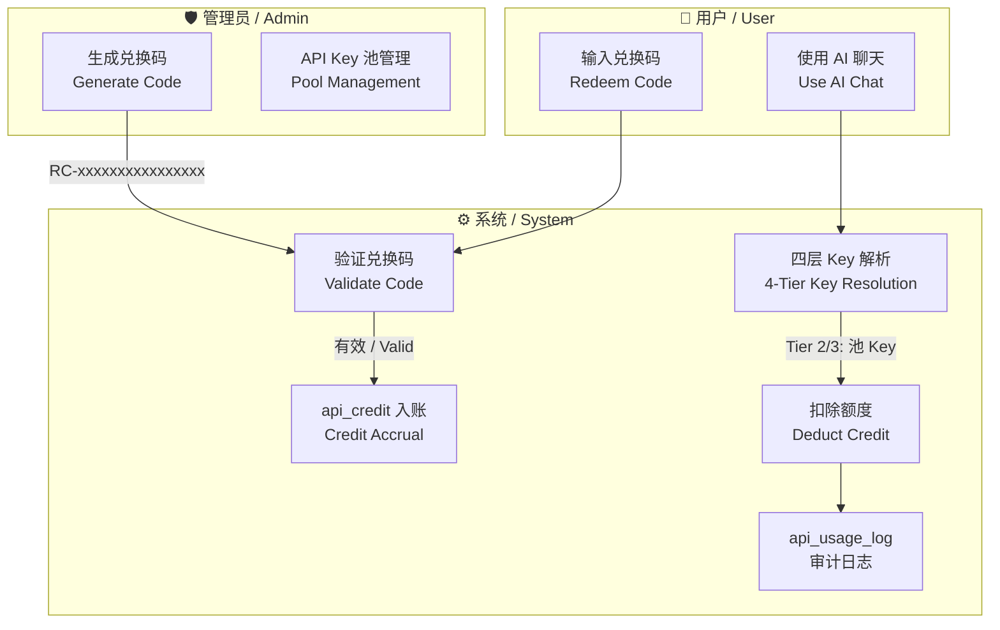
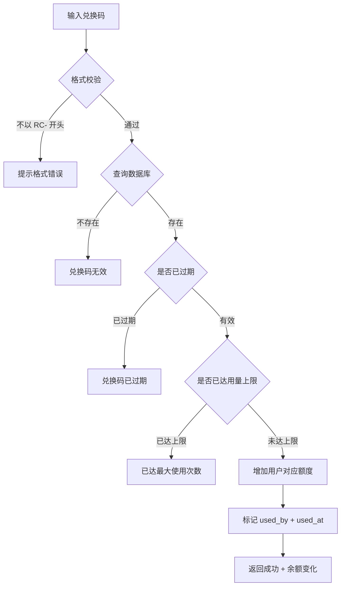

# 兑换码系统 / Redemption Code System

> 本文档描述 AIsChat 的兑换码体系：四种额度类型、生成与兑换流程、API Key 池集成、额度消耗机制与安全设计。
> This document describes the redemption code system: four quota types, generation & redemption flow, API Key pool integration, credit consumption mechanism, and security design.

---

## 1. 架构总览 / Architecture Overview



**关键设计**：兑换码是一次性凭证（格式 `RC-` + 16 位 hex），四种额度类型覆盖不同的资源维度。v0.6.0 引入 API Key 池后，通用 API 额度（`api_credit`）与池 Key 深度集成——用户无需自备 API Key 也能使用 AI，消耗自动从额度中扣除。

---

## 2. 额度类型 / Quota Types

| 类型 | 兑换码 type | users 表字段 | 说明 |
|------|-----------|-------------|------|
| **AI 创建额度** | `ai_quota` | `ai_quota` | 每创建 1 个 AI 消耗 1 点。注册默认赠送 3 点 |
| **通用 API 额度** | `api_credit` | `api_credit` | 1 余额 = 10,000 token（pay-as-you-go）。使用池 Key 时自动扣除 |
| **AI 包断额度** | `agent_bundle` | `agent_bundle_credit` | 创建 AI 时一次性支付，该 AI 后续 API 调用全免 |
| **文件存储配额** | `file_quota` | `file_quota_mb` | 单位 MB，控制文件上传空间上限 |

---

## 3. 兑换码格式 / Code Format

```
RC-A1B2C3D4E5F67890
││ │              │
││ └── 16 位 hex 大写 ── 随机生成，全局唯一
│└── 连接符
└── 固定前缀，便于识别
```

- **前缀**：`RC-`（Redemption Code）
- **随机部分**：16 位十六进制大写（`secrets.token_hex(8).upper()`），碰撞概率 ≈ 2^-64
- **存储**：`redemption_codes` 表，`code` 列有 UNIQUE 约束

---

## 4. 管理员生成 / Admin Generation

### 4.1 操作位置

管理面板 → **兑换码** Tab → 点击「生成兑换码」

### 4.2 表单字段

| 字段 | 必填 | 说明 |
|------|------|------|
| **额度类型** | ✅ | 四选一：AI 创建 / 通用 API / AI 包断 / 文件配额 |
| **数量** | ✅ | 批量生成数量（1–100） |
| **过期时间** | 选填 | 不填则永久有效 |
| **备注**（v0.6.0） | 选填 | 仅管理员可见，用于标记用途（如"张三充值 10 元"） |
| **单码最大用量**（v0.6.0） | 选填 | 限制此码可兑换的次数，不填则无限次 |
| **API 池额度**（v0.6.0） | 开关 | 标记此码为 API 池专用额度，兑换后需配合池 Key 使用 |

### 4.3 生成逻辑

```python
def generate_code(db, type, amount, expires_at, note, max_usage, is_api_pool):
    codes = []
    for _ in range(amount):
        code = "RC-" + secrets.token_hex(8).upper()
        db.add(RedemptionCode(
            code=code,
            type=type,
            amount=amount_per_code,
            expires_at=expires_at,
            note=note,                      # v0.6.0
            max_usage=max_usage,            # v0.6.0
            is_api_pool=is_api_pool,        # v0.6.0
        ))
        codes.append(code)
    return codes
```

- 管理员可在列表页看到所有兑换码，**备注字段仅管理员可见**
- 列表显示：code、类型、数量、备注（截断）、API 池标记（琥珀色「池」徽章）、创建时间、是否已使用
- AI 创建额度兑换后**不返还**（防滥用）

---

## 5. 用户兑换 / User Redemption

### 5.1 操作位置

底部导航「**我的**」→ 兑换码输入框 → 点击「兑换」

### 5.2 兑换流程



### 5.3 前后端交互

**请求**：`POST /user/redeem`
```json
{ "code": "RC-A1B2C3D4E5F67890" }
```

**响应**：
```json
{
  "message": "兑换成功",
  "type": "api_credit",
  "amount": 10,
  "new_balance": 15
}
```

---

## 6. API Key 池集成 / Pool Integration（v0.6.0）

### 6.1 为什么需要池

v0.6.0 之前，用户如果没有配置自己的 API Key，即使有 `api_credit` 也无法使用 AI。池 Key 填补了这个缺口——管理员可预先在池中添加共享 API Key，用户兑换 `api_credit` 后自动从池中分配。

### 6.2 池 Key 管理

管理面板 → **API 库** Tab：

| 操作 | 说明 |
|------|------|
| **添加** | 输入名称、API Base URL、API Key（密码框）、优先级 |
| **编辑** | 修改名称、启用/禁用、优先级 |
| **删除** | 移除池 Key。已绑定此 Key 的用户下次调用时自动切换到其他可用 Key |
| **列表** | 名称、URL、脱敏 Key（`****后四位`）、优先级、状态开关 |

### 6.3 安全设计

- 池 Key 使用 **Fernet 对称加密**（与用户自有 Key 相同的加密方案）
- 管理员添加 Key 时输入一次明文，保存后**仅存储密文**
- 列表展示格式：`****a3f2`（仅密文后四位）
- 管理员**无法查看已存储 Key 的明文**
- 加密密钥来自 `ENCRYPTION_KEY` 环境变量（默认复用 `JWT_SECRET_KEY`）

### 6.4 用户绑定缓存

每个用户与池 Key 的绑定关系存储在 `user_api_assignments` 表：

| 字段 | 说明 |
|------|------|
| `user_id` | UNIQUE，每用户仅绑定一个池 Key |
| `pool_key_id` | 指向 `api_key_pool.id` |
| `assigned_at` | 首次分配时间 |
| `last_used_at` | 最近一次使用时间 |

**优势**：用户下次请求时直接查绑定表（O(1)），无需每次遍历全池选 Key。绑定 Key 失效（被禁用/删除）时自动重新分配。

---

## 7. 额度消耗 / Credit Consumption（v0.6.0）

### 7.1 四层 Key 解析优先链

```
Tier 1: Agent 自有 Key         → 不扣额度（Agent 自己承担）
Tier 2: 用户绑定池 Key（缓存）  → 扣 api_credit（命中缓存，最快）
Tier 3: 自动选最优池 Key       → 扣 api_credit（首次或缓存失效）
Tier 4: 用户自有 Key           → 不扣额度（用户自己承担）
```

### 7.2 消耗规则

| 规则 | 值 | 说明 |
|------|-----|------|
| 兑换比例 | 1 credit = 10,000 tokens | 可通过 `CREDIT_PER_TOKENS` 环境变量调整 |
| 最低扣除 | 0.01 credit / 次 | 防零成本调用 |
| 扣除时机 | LLM 调用结束后 | `_tool_call_loop` 出口处，不阻塞主流程 |
| 并发保护 | `SELECT FOR UPDATE` | 防止并发扣除导致额度超用 |
| 审计日志 | `api_usage_log` 表 | 记录每次扣款的 user_id/agent_id/pool_key_id/tokens/credit/model |

### 7.3 用户端展示

用户可在「**我的**」页面查看：
- **通用额度卡片**：余额 + 估算 Token 数（`api_credit × 10000`）+ 绑定的池 Key 名称
- **侧边栏**：显示「额度 · 余额」双数字

---

## 8. 数据库表 / Database Tables

### 8.1 redemption_codes

| 列 | 类型 | 说明 |
|-----|------|------|
| `id` | SERIAL PK | — |
| `code` | VARCHAR(32) UNIQUE | RC- + 16 hex |
| `type` | VARCHAR(20) | ai_quota / api_credit / agent_bundle / file_quota |
| `amount` | INTEGER | 面额 |
| `expires_at` | TIMESTAMP | NULL = 永久 |
| `used_by` | INTEGER FK→users | 使用者 |
| `used_at` | TIMESTAMP | 使用时间 |
| `note` | TEXT（v0.6.0） | 管理员备注 |
| `max_usage` | INTEGER（v0.6.0） | 单码最大用量 |
| `is_api_pool` | BOOLEAN（v0.6.0） | API 池额度标记 |
| `created_at` | TIMESTAMP（v0.6.0） | 创建时间 |

### 8.2 api_key_pool（v0.6.0）

| 列 | 类型 | 说明 |
|-----|------|------|
| `id` | SERIAL PK | — |
| `name` | VARCHAR(100) | 可读名称（如"DeepSeek 主号"） |
| `api_base_url` | TEXT | API 端点 |
| `api_key_encrypted` | TEXT | Fernet 密文 |
| `is_active` | BOOLEAN | 禁用后自动切换 |
| `priority` | INTEGER | 越小越优先 |
| `created_at` / `updated_at` | TIMESTAMP | — |

### 8.3 user_api_assignments（v0.6.0）

| 列 | 类型 | 说明 |
|-----|------|------|
| `id` | SERIAL PK | — |
| `user_id` | INTEGER FK UNIQUE | 每用户一条 |
| `pool_key_id` | INTEGER FK | 指向池 Key |
| `assigned_at` | TIMESTAMP | 首次分配 |
| `last_used_at` | TIMESTAMP | 最近使用 |

### 8.4 api_usage_log（v0.6.0）

| 列 | 类型 | 说明 |
|-----|------|------|
| `id` | SERIAL PK | — |
| `user_id` | INTEGER FK | 谁消耗的 |
| `agent_id` | INTEGER FK | 哪个 AI 产生的 |
| `pool_key_id` | INTEGER FK | 用了哪个池 Key |
| `source` | VARCHAR(20) | agent_key / pool_key / user_key |
| `tokens_used` | INTEGER | 本次消耗 token 数 |
| `credit_spent` | NUMERIC(6,2) | 本次扣除额度 |
| `model` | VARCHAR(50) | 使用的模型 |
| `created_at` | TIMESTAMP | — |

---

## 9. 相关 API / Related Endpoints

| 方法 | 路径 | 角色 | 说明 |
|------|------|------|------|
| `POST` | `/admin/redemption-codes` | 管理员 | 生成兑换码 |
| `GET` | `/admin/redemption-codes` | 管理员 | 列出所有兑换码 |
| `POST` | `/user/redeem` | 用户 | 兑换 |
| `GET` | `/admin/api-key-pool` | 管理员 | 列出池 Key（脱敏） |
| `POST` | `/admin/api-key-pool` | 管理员 | 添加池 Key |
| `PUT` | `/admin/api-key-pool/{id}` | 管理员 | 更新池 Key |
| `DELETE` | `/admin/api-key-pool/{id}` | 管理员 | 删除池 Key |
| `GET` | `/user/credit-status` | 用户 | 余额 + 估算 Token + 绑定 Key 名 |

---

## 10. 安全注意事项 / Security Notes

1. **备注保密**：`note` 字段仅管理员在管理面板可见，不会通过任何用户端 API 泄露
2. **Key 加密**：池 Key 和用户自有 Key 均使用 Fernet 加密，密钥不在数据库中
3. **一次一用**：兑换码使用后立即标记 `used_by` + `used_at`，不可重复使用
4. **AI 创建不返还**：`ai_quota` 类型兑换码创建 AI 后不返还，防止恶意刷码
5. **并发防护**：`deduct_credit()` 使用 `SELECT FOR UPDATE` 行锁，防止并发扣除导致额度超用
6. **额度扣除不阻塞**：LLM 调用出口处的 `deduct_credit` 失败时仅记录 warning，不影响消息发送

---

> **AIsChat — 让 AI 不只是工具，是陪伴。**
> **AIsChat — Not just tools. Companions.**
>
> v0.6.0 · 2026 年 6 月
