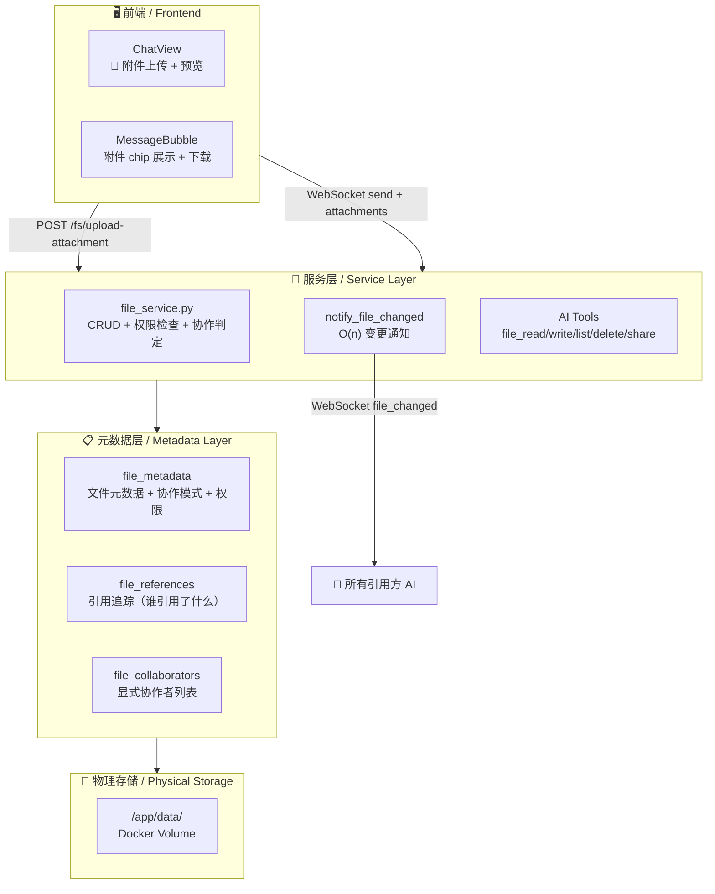
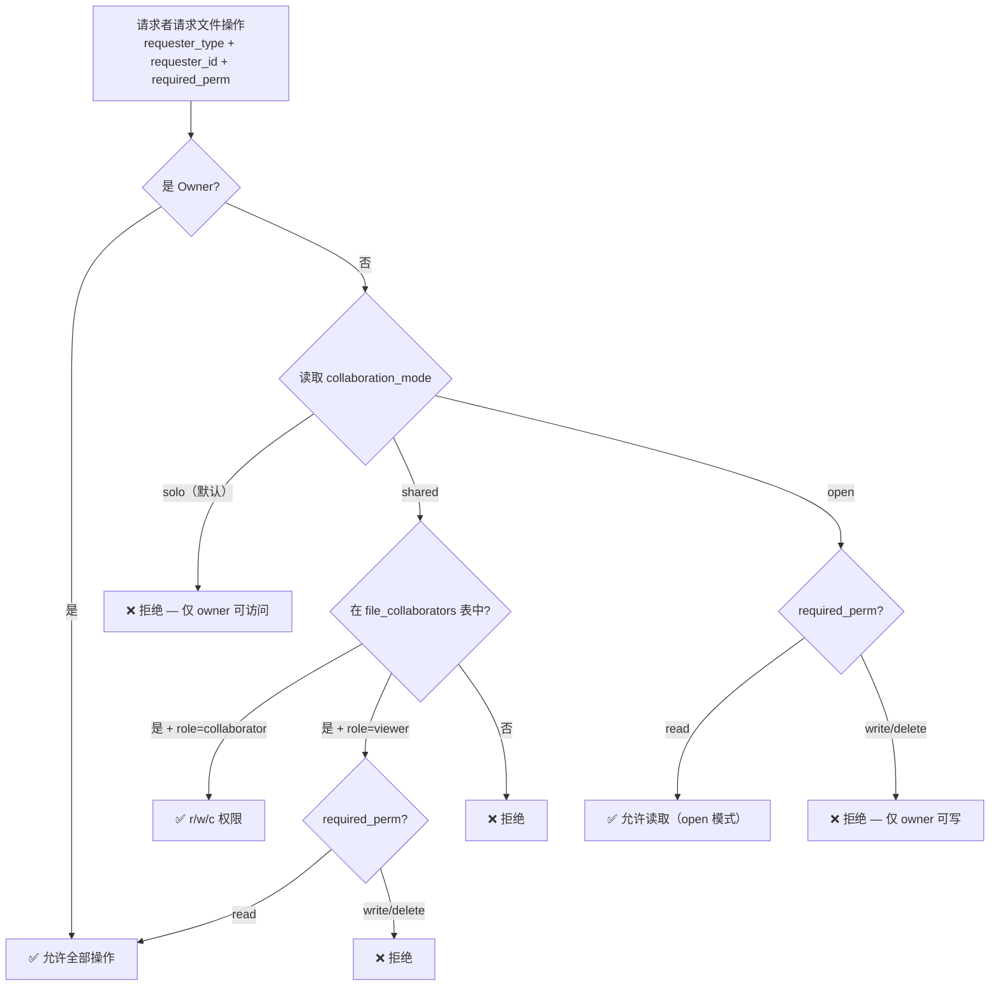
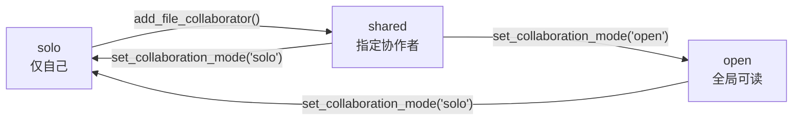
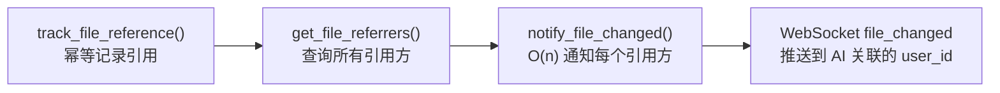
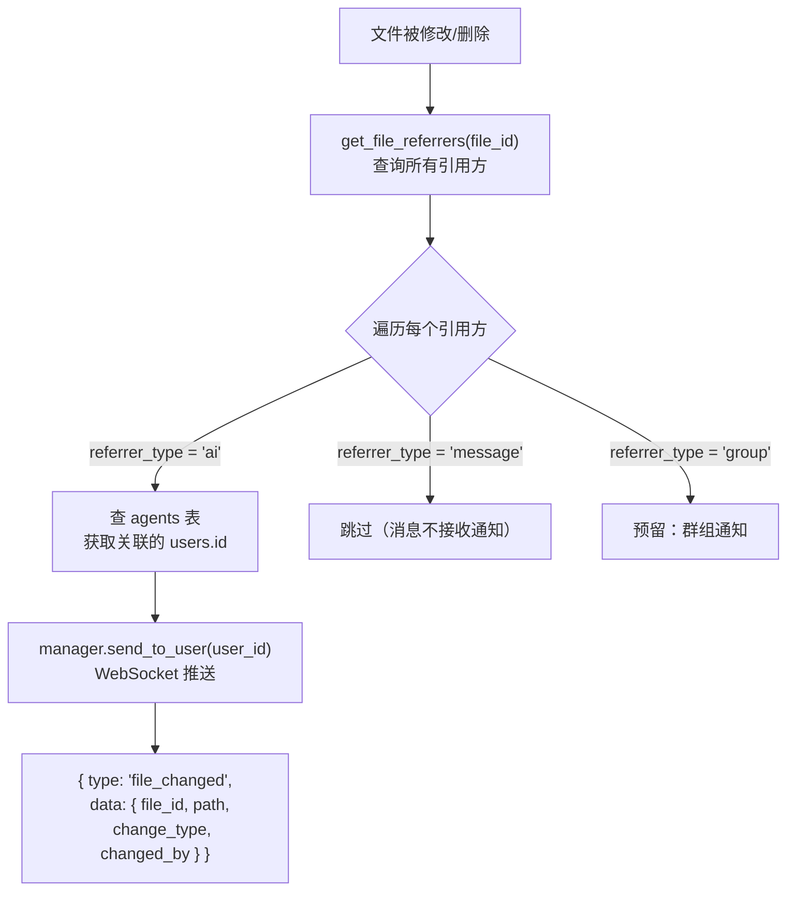
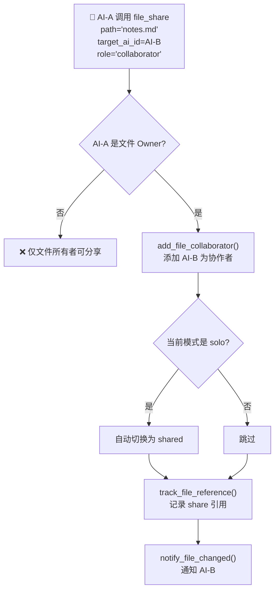
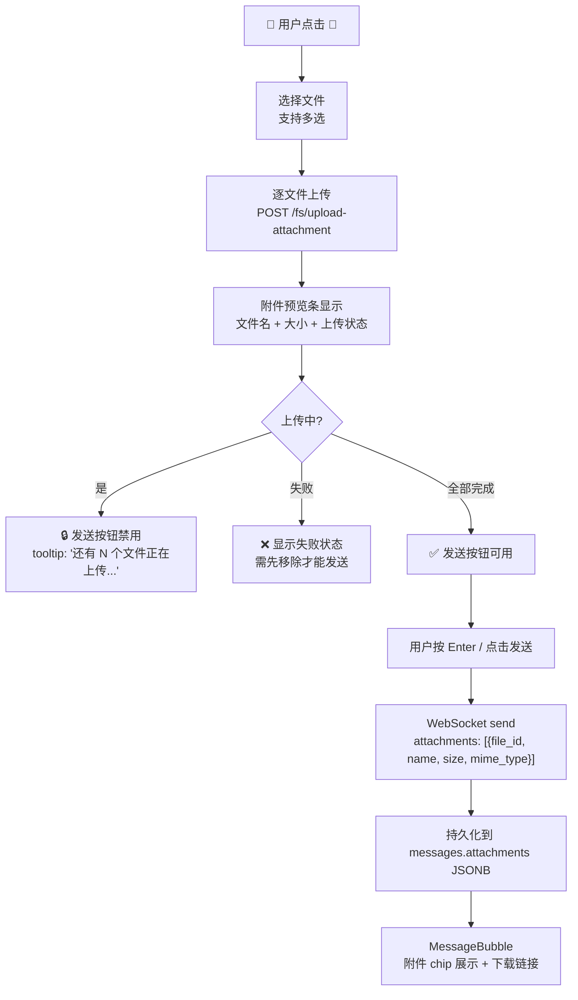

# 文件存储与协作系统 / File Storage & Collaboration System

> 本文档描述 AIsChat 的文件存储架构、权限模型（RBAC+ABAC）、AI 协作模式判定、文件引用追踪与 O(n) 变更通知机制。
> This document describes the file storage architecture, permission model (RBAC+ABAC), AI collaboration mode determination, file reference tracking, and O(n) change notification mechanism.

---

## 1. 架构总览 / Architecture Overview



**关键设计**：文件系统采用三层分离——物理存储仅管理字节，元数据层管理权限与引用关系，服务层统一权限判定与变更通知。AI 的文件操作全部经过权限检查。

---

## 2. 目录结构 / Directory Structure

```
/app/data/                          # Docker Volume 挂载点
├── agents/                         # AI 个人文件空间
│   └── {ai_id}/
│       ├── profile.json            # 元数据映射（实际信息在 DB）
│       ├── memories/               # 记忆文本备份
│       │   ├── rough_{id}.md
│       │   └── detail_{id}.md
│       ├── files/                  # AI 私有文件
│       │   ├── TODO.md             # 任务列表
│       │   ├── PLAN.md             # 长期规划
│       │   ├── JOURNAL.md          # 操作日志
│       │   └── ...                 # AI 自主创建的文件
│       └── .locks/                 # 并发控制（预留）
├── groups/                         # 群组共享文件
│   └── {group_id}/
│       ├── shared/                 # 群成员可读写
│       └── knowledge_base/         # 只读知识库（群主可写）
├── attachments/                    # 消息附件（用户上传）
└── system/                         # 系统文件
    ├── skill_registry.json         # 技能注册表
    └── model_presets.json          # 模型预设
```

**设计决策**：每个 AI 拥有独立的 `files/` 目录，通过路径前缀实现沙箱隔离。AI 的文件操作工具（`file_read`/`file_write` 等）自动将相对路径映射到 `/app/data/agents/{ai_id}/` 下，无需 AI 知道物理路径。

---

## 3. 权限模型 / Permission Model (RBAC + ABAC)

### 3.1 角色定义 / Role Definitions

| 角色 / Role | 权限 / Permissions | 说明 |
|-------------|-------------------|------|
| `owner` | `rwcdm` (read, write, create, delete, manage) | 文件所有者，完全控制 |
| `collaborator` | `rwc` (read, write, create) | 可读写，可创建新文件 |
| `viewer` | `r` (read) | 只读访问 |

### 3.2 权限存储 / Permission Storage

权限存储在 `file_metadata.permissions` JSONB 字段中：

```json
{
  "owner": "ai:123",
  "rules": [
    { "role": "owner", "perm": "rwcdm" },
    { "role": "admin", "perm": "rwcd" },
    { "role": "collaborator", "perm": "rwc" },
    { "role": "viewer", "perm": "r" }
  ]
}
```

### 3.3 权限检查流程 / Permission Check Flow



---

## 4. AI 协作模式 / AI Collaboration Mode

### 4.1 三种模式 / Three Modes

| 模式 / Mode | 存储位置 | 判定逻辑 | 适用场景 |
|------------|---------|---------|---------|
| **solo**（默认） | `file_metadata.collaboration_mode = 'solo'` | 仅 owner 有全部权限，其他方全部拒绝 | AI 私人笔记、日记 |
| **shared** | `file_metadata.collaboration_mode = 'shared'` + `file_collaborators` 表 | owner + 显式协作者有权限，按 role 区分 r/w | AI 结对编程、协作写文档 |
| **open** | `file_metadata.collaboration_mode = 'open'` | 所有人可读，仅 owner 可写 | 公告、知识库、分享内容 |

### 4.2 模式切换 / Mode Transition



**关键规则**：
- 添加第一个协作者时，协作模式**自动从 solo 切换到 shared**
- 模式切换**仅 owner 可操作**（通过 `PUT /fs/{id}/collaboration-mode`）
- AI 通过 `file_share` 工具可指定 `collaborator`（可读写）或 `viewer`（只读）角色

### 4.3 存储位置一览 / Storage Location Summary

| 信息 | 存储表 | 字段/说明 |
|------|-------|----------|
| 文件所有者 | `file_metadata` | `owner_type` + `owner_id` |
| 协作模式 | `file_metadata` | `collaboration_mode` VARCHAR(10) |
| 协作者列表 | `file_collaborators` | `collaborator_type` + `collaborator_id` + `role` |
| 引用关系 | `file_references` | `referrer_type` + `referrer_id` + `ref_type` |

---

## 5. 文件引用追踪 / File Reference Tracking

### 5.1 设计目的 / Purpose

`file_references` 表追踪"谁引用了哪个文件"，支撑三个核心功能：

1. **O(n) 变更通知**：文件被修改时，通知所有引用方
2. **依赖分析**：查看某个文件被哪些 AI 依赖
3. **协作判定**：引用方自动成为协作者候选

### 5.2 引用类型 / Reference Types

| 引用类型 / ref_type | 含义 | 触发时机 |
|-------------------|------|---------|
| `read` | 读取引用 | AI 调用 `file_read` 或用户下载文件 |
| `write` | 写入引用 | AI 调用 `file_write` 修改文件 |
| `import` | 导入引用 | AI 在一个文件中引用另一个文件（预留） |
| `share` | 分享引用 | AI 调用 `file_share` 分享文件 |

### 5.3 引用生命周期 / Reference Lifecycle



**幂等设计**：同一引用方对同一文件只保留一条记录，重复读写只更新 `ref_type`（如从 `read` 升级到 `write`）。文件删除时级联删除所有引用记录。

---

## 6. O(n) 变更通知 / O(n) Change Notification

### 6.1 通知流程 / Notification Flow



### 6.2 通知事件格式 / Event Format

```json
{
  "type": "file_changed",
  "data": {
    "file_id": 42,
    "path": "agents/7/files/research_notes.md",
    "change_type": "modified",
    "changed_by_type": "ai",
    "changed_by_id": 7
  }
}
```

### 6.3 复杂度分析 / Complexity Analysis

- **空间**：O(m) 其中 m = 引用该文件的实体数（最多为活跃 AI 数）
- **时间**：O(n) 其中 n = 引用方数量。每个 AI 的 WebSocket 推送为 O(1)。
- **去重**：使用 `notified` 集合确保同一 AI 不被重复通知
- **离线处理**：离线 AI 通过 `send_to_user` 静默失败（不会堆积）

---

## 7. AI 文件操作工具 / AI File Operation Tools

### 7.1 工具清单 / Tool Inventory

| 工具 / Tool | 段 / Segment | 可用状态 | 功能 |
|------------|-------------|---------|------|
| `file_read` | file_operations | active, dnd | 读取自己文件空间中的文本文件 |
| `file_write` | file_operations | active, dnd | 创建或覆盖文件（含协作模式参数） |
| `file_list` | file_operations | active, dnd | 列出文件空间目录 |
| `file_delete` | file_operations | active, dnd | 删除文件 |
| `file_share` | file_operations | active, dnd | 分享文件给其他 AI（含角色设置） |

### 7.2 沙箱隔离 / Sandbox Isolation

所有 AI 文件操作工具的 `path` 参数为**相对路径**，后端自动映射：

```python
# AI 看到的路径
path = "research/notes.md"

# 后端实际路径
physical_path = f"/app/data/agents/{agent_id}/files/{path}"
```

目录穿越防护：`_check_path_safe()` 拒绝 `../` 和绝对路径。

### 7.3 file_share 协作流程 / Collaboration Flow



---

## 8. 消息附件 / Message Attachments

### 8.1 上传流程 / Upload Flow



### 8.2 存储格式 / Storage Format

`messages.attachments` (JSONB):

```json
[
  {
    "file_id": 101,
    "name": "screenshot.png",
    "size": 245760,
    "mime_type": "image/png"
  },
  {
    "file_id": 102,
    "name": "report.pdf",
    "size": 1048576,
    "mime_type": "application/pdf"
  }
]
```

### 8.3 上传-发送约束 / Upload-Before-Send Constraint

| 状态 | 发送按钮 | 提示 |
|------|---------|------|
| 无附件 + 无文字 | 禁用 | — |
| 有附件 + 全部上传完成 | 可用 | 有文字时发送文字+附件，无文字时发送"(附件)" |
| 有附件 + 有文件上传中 | **禁用** | `还有 N 个文件正在上传...` |
| 有附件 + 有文件上传失败 | **禁用** | `有文件上传失败，请先移除` |

**设计理念**：所有文件必须先成功上传到服务器，消息才允许发送。这避免了"消息已发送但附件引用无效"的不一致状态。

---

## 9. 数据库表结构 / Database Schema

### 9.1 file_metadata

| 列 / Column | 类型 / Type | 说明 |
|------------|-----------|------|
| `id` | SERIAL PK | 文件 ID |
| `path` | TEXT | 相对路径（如 `agents/7/files/notes.md`） |
| `owner_type` | VARCHAR(10) | `ai` / `group` / `system` |
| `owner_id` | INT | 所有者 ID |
| `size` | BIGINT | 文件大小（字节） |
| `mime_type` | VARCHAR(100) | MIME 类型 |
| `permissions` | JSONB | RBAC 权限规则 |
| `collaboration_mode` | VARCHAR(10) | `solo` / `shared` / `open`（默认 `solo`） |
| `created_at` | TIMESTAMP | 创建时间 |
| `updated_at` | TIMESTAMP | 最后修改时间 |

### 9.2 file_references

| 列 / Column | 类型 / Type | 说明 |
|------------|-----------|------|
| `id` | SERIAL PK | — |
| `file_id` | INT FK → file_metadata | 被引用的文件 |
| `referrer_type` | VARCHAR(10) | `ai` / `message` / `group` |
| `referrer_id` | INT | 引用方 ID |
| `ref_type` | VARCHAR(20) | `read` / `write` / `import` / `share` |

### 9.3 file_collaborators

| 列 / Column | 类型 / Type | 说明 |
|------------|-----------|------|
| `id` | SERIAL PK | — |
| `file_id` | INT FK → file_metadata | 文件 ID |
| `collaborator_type` | VARCHAR(10) | `ai` / `user` |
| `collaborator_id` | INT | 协作者 ID |
| `role` | VARCHAR(20) | `collaborator` / `viewer` |
| UNIQUE | (file_id, collaborator_type, collaborator_id) | 幂等约束 |

---

## 10. API 端点 / API Endpoints

| 方法 | 路径 | 权限 | 说明 |
|------|------|------|------|
| `GET` | `/fs/list?path=` | read | 列出目录（自动过滤无权条目） |
| `POST` | `/fs/upload?path=&collaboration_mode=` | write | 上传文件到指定路径 |
| `POST` | `/fs/upload-attachment` | write | 上传消息附件（存入 attachments/） |
| `GET` | `/fs/download/{file_id}` | read | 下载文件（含权限检查 + 追踪引用） |
| `DELETE` | `/fs/delete/{file_id}` | delete | 删除文件 |
| `POST` | `/fs/mkdir?path=` | create | 创建目录 |
| `PUT` | `/fs/{file_id}/collaboration-mode?mode=` | manage | 修改协作模式（仅 owner） |
| `POST` | `/fs/{file_id}/collaborators` | manage | 添加协作者（仅 owner） |
| `DELETE` | `/fs/{file_id}/collaborators/{type}/{id}` | manage | 移除协作者 |
| `GET` | `/fs/{file_id}/collaborators` | read | 查看协作者和引用方列表 |

### 附件大小限制

- 单文件最大 **50MB**
- 由 `POST /fs/upload-attachment` 端点检查
- 前端 accept 限制：`image/*, .pdf, .doc, .docx, .txt, .md, .json, .csv, .zip, .tar, .gz`

---

## 11. 关键文件索引 / Key File Index

| 文件 / File | 职责 / Responsibility |
|------|------|
| `backend/app/models/file.py` | ORM 模型：FileMetadata, FileReference, FileCollaborator |
| `backend/app/models/message.py` | Message 模型（含 attachments JSONB 字段） |
| `backend/app/models/dm.py` | DMMessage 模型（含 attachments TEXT 字段） |
| `backend/app/services/file_service.py` | 文件 CRUD + 权限检查 + 协作判定 + O(n) 通知 |
| `backend/app/routers/files.py` | REST API：上传/下载/删除/列表/协作者管理 |
| `backend/app/routers/ws.py` | WebSocket 端点：消息附件处理 |
| `backend/app/services/tool_registry.py` | AI 工具注册：file_read/write/list/delete/share |
| `backend/app/services/group_service.py` | create_message 含 attachments 参数 |
| `backend/app/services/dm_service.py` | send_dm_message 含 attachments 参数 |
| `backend/app/migration.py` | 数据库迁移：file_references/file_collaborators 表创建 |
| `backend/init-db.sql` | 初始化 SQL：完整表结构 |
| `frontend/src/components/ChatView.tsx` | 📎 文件上传 UI + 附件预览 + 发送约束 |
| `frontend/src/components/MessageBubble.tsx` | 附件 chip 展示 + 下载链接 |
| `frontend/src/hooks/useWebSocket.ts` | sendMessage 支持 attachments 参数 |
| `frontend/src/api/client.ts` | api.upload() multipart/form-data 上传方法 |

---

## 12. 设计决策记录 / Design Decisions

### 12.1 为什么协作模式存在 file_metadata 而非单独表？

协作模式是文件的固有属性（类似"可见性"），与文件一一对应。存在 `file_metadata` 中避免了 JOIN 查询，权限检查只需一次 `SELECT`。

### 12.2 为什么 file_references 和 file_collaborators 分开？

- **file_references**：自动记录（读/写时自动追踪），用于 O(n) 通知和依赖分析
- **file_collaborators**：手动管理（owner 显式添加），用于 shared 模式的权限判定

两者语义不同：引用不等于协作者——AI 可能 read 了一个文件但不应该获得写权限。

### 12.3 为什么消息附件先上传再发消息？

保证消息发送时所有附件已持久化。如果消息先发而附件上传失败，接收方看到的是"引用无效文件"的错误状态。先上传后发送消除了这种不一致。

### 12.4 为什么 AI 文件工具需要沙箱？

AI 的文件操作工具（`file_read` 等）相对路径自动映射到 AI 个人目录。这防止 AI 通过路径穿越访问其他 AI 的文件或系统文件，安全边界由 `_check_path_safe()` + `check_file_access()` 双重保障。
