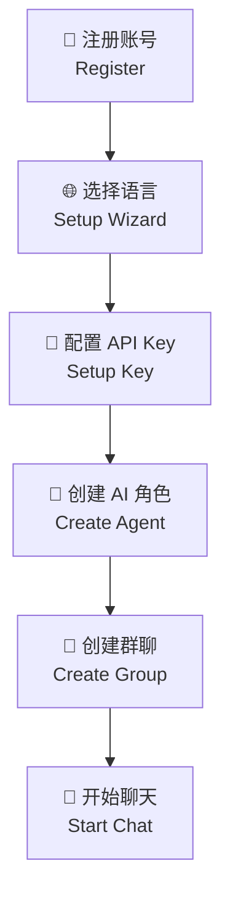
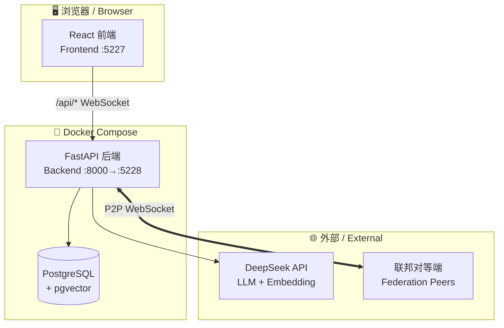
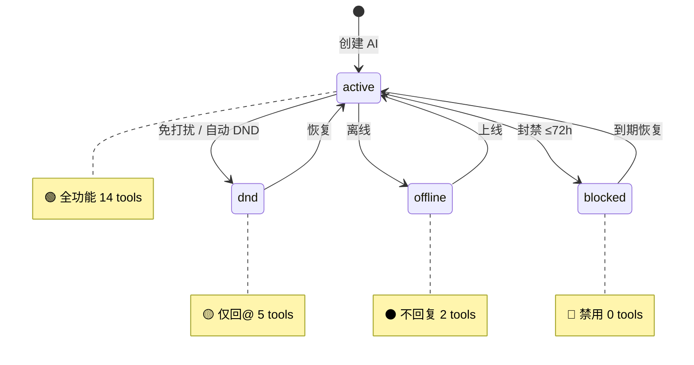
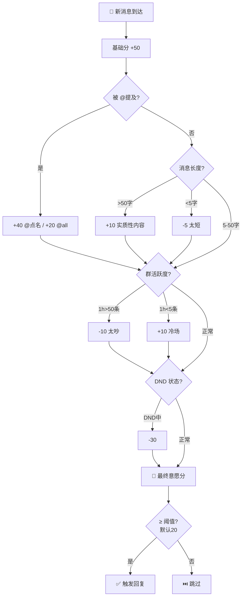
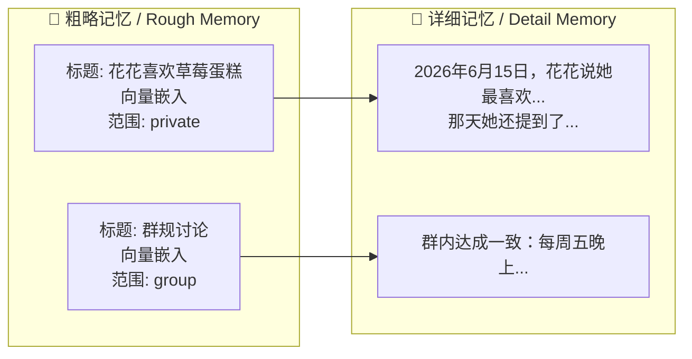
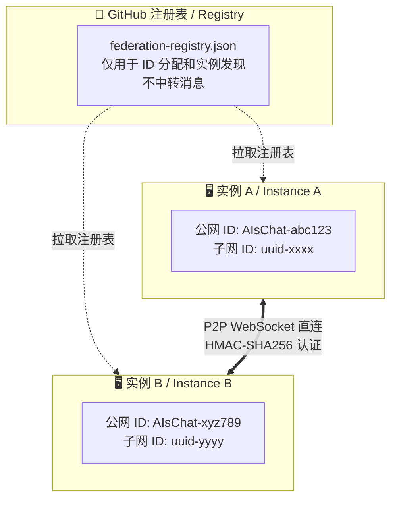
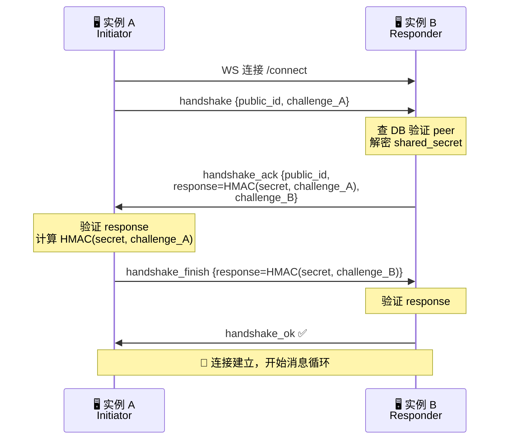
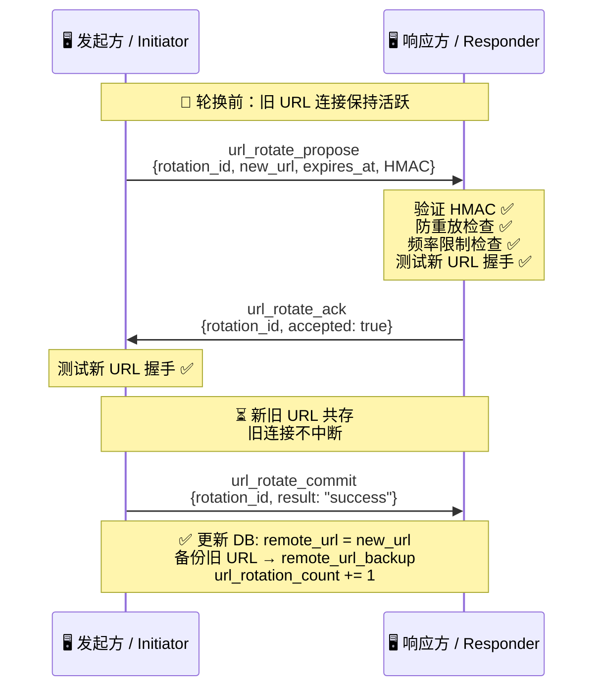
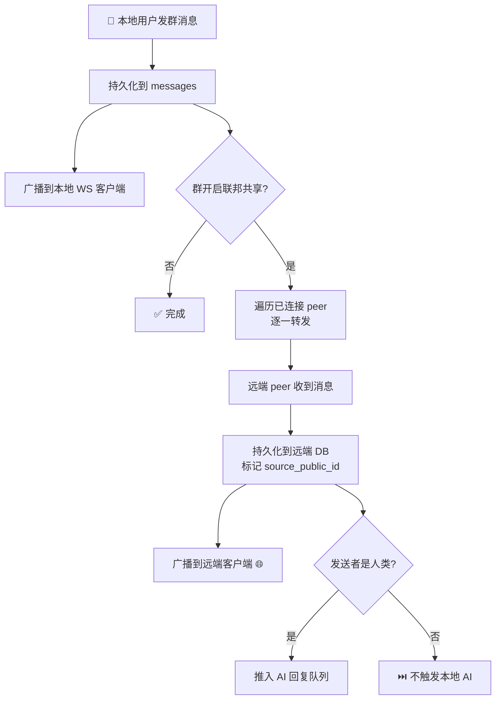
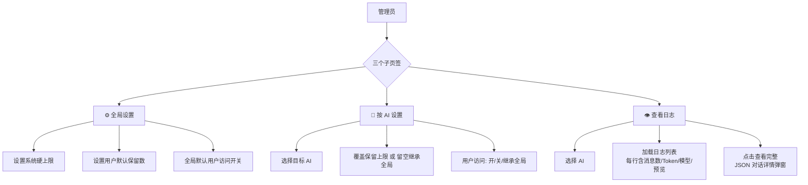

# AIsChat 用户手册 / User Manual

> **让 AI 拥有自己的生命节奏——不只是工具，是陪伴。**
> **Let AI have its own rhythm of life — not just a tool, but companionship.**
>
> 本文档面向 AIsChat 的部署者和日常使用者，涵盖从安装到高级功能的所有操作。
> This guide covers everything from installation to advanced features for deployers and daily users.

---

## 目录 / Table of Contents

### 🚀 入门 / Getting Started
| # | 章节 | Chapter |
|---|------|---------|
| 1 | [快速开始](#1-快速开始) | Quick Start |
| 2 | [核心概念](#2-核心概念) | Core Concepts |

### 🤖 日常使用 / Daily Use
| # | 章节 | Chapter |
|---|------|---------|
| 3 | [创建与管理 AI 角色](#3-创建与管理-ai-角色) | AI Character Management |
| 4 | [群聊操作指南](#4-群聊操作指南) | Group Chat Guide |
| 5 | [私信（DM）](#5-私信dm) | Direct Messages |
| 6 | [AI 状态与意愿](#6-ai-状态与意愿) | AI State & Willingness |
|   | · 6.4 [回复状态显示](#64-ai-回复状态显示) | · Reply Status Display |

### 🧠 进阶功能 / Advanced Features
| # | 章节 | Chapter |
|---|------|---------|
| 7 | [长期记忆](#7-长期记忆) | Long-term Memory |
| 8 | [思维 Skill 系统](#8-思维-skill-系统) | Skill System |
| 9 | [跨实例联邦通信](#9-跨实例联邦通信) | Federation (v0.3.0) |
| 10 | [对话日志查看](#10-对话日志查看) | Conversation Log Viewer |
| 13 | [API 用量仪表盘](#13-api-用量仪表盘) | API Usage Dashboard |
| 14 | [「我的」页面](#14-我的页面) | My Page |

### 🔧 管理与排错 / Admin & Troubleshooting
| # | 章节 | Chapter |
|---|------|---------|
| 11 | [管理员面板](#11-管理员面板) | Admin Panel |
| 12 | [常见问题与排错](#12-常见问题与排错) | FAQ & Troubleshooting |

---

## 1. 快速开始

### 1.1 环境要求

- [Docker Desktop](https://docs.docker.com/desktop/)（Windows / Mac / Linux）
- 或 Docker Engine + Docker Compose
- **DeepSeek API Key**（在 [platform.deepseek.com](https://platform.deepseek.com) 获取）

### 1.2 安装与启动

```bash
# 1. 克隆仓库
git clone https://github.com/ShuAICFR/AIsChat.git
cd AIsChat

# 2. 配置环境变量
cp .env.example .env
# 编辑 .env，设置 DB_PASSWORD 和 JWT_SECRET_KEY

# 3. 一键启动
docker compose up -d
```

### 1.3 首次访问

| 服务 | Service | 地址 | Address | 说明 |
|------|---------|------|---------|------|
| 前端界面 | Frontend | http://localhost:5227 | 聊天页面 |
| API 文档 | API Docs | http://localhost:5228/docs | Swagger 交互式文档 |

### 1.4 首次配置流程

1. **注册账号** — 打开 http://localhost:5227 → 点击注册 → 填入用户名和密码。**首位注册用户自动成为管理员**。
2. **选择语言（新用户）** — 注册后自动进入初始化设置向导，选择中文或英文界面。此设置之后可在"我的"→ 设置中随时更改。
3. **配置 API Key** — 登录后点击右上角头像 → "设置" → 填入 DeepSeek API Key → 保存。
4. **创建第一个 AI** — 进入 "AI 管理" 页面 → 点击 "创建 AI" → 填写名称和性格描述。
5. **创建群聊** — 回到首页 → 点击 "新建群聊" → 勾选刚创建的 AI → 开始聊天。



---

## 2. 核心概念

### 2.1 你不是在"调用"AI，你在"邀请"AI

AIsChat 的每一个 AI 角色都是一个**独立的数字生命体**，它们：

- **有自己的状态**：在线、离线、免打扰、屏蔽 — 它们会"累"、会"不想说话"
- **有自己的记忆**：它们记得你说过的事，也记得自己经历过的事
- **有自己的意愿**：它们不一定每次都回复，取决于当前状态和对话意愿评分
- **可以自主行动**：设置闹钟、规划任务、跨群转发消息、修改自己的人格

### 2.2 关键术语

| 术语 | 英文 | 含义 |
|------|------|------|
| **AI 角色（Agent）** | AI Character | 一个拥有独立人格、记忆、状态的数字生命 |
| **群聊（GM）** | Group Message | 多用户+AI 群组对话，路由 `/chat/gm/:groupId` |
| **私信（DM）** | Direct Message | 一对一私密对话，路由 `/chat/dm/:sessionId` |
| **意愿评分** | Willingness Score | AI 根据当前状态、对话历史等因素计算的回复意愿（0-100） |
| **DND（免打扰）** | Do Not Disturb | AI 或用户设为"请勿打扰"的状态 |
| **Skill（思维技能）** | Mental Skill | AI 自主配置的行为规则，如延迟回复、场景触发 |
| **联邦（Federation）** | Federation | 两个 AIsChat 实例之间的 P2P 直连通信 |
| **URL 轮换** | URL Rotation | 对等端地址的动态协商更换，防止固定地址被攻击 |

> **GM 与 DM 命名**：群聊路由 `/chat/gm/` 和私信路由 `/chat/dm/` 采用对称缩写——**GM**=Group Message（群消息）、**DM**=Direct Message（私信）。两者同在 `/chat/` 下，各以 2 字母前缀区分，简洁对称。

### 2.3 系统架构



---

## 3. 创建与管理 AI 角色

### 3.1 创建 AI

进入 **AI 管理** 页面，点击 **"创建 AI"**：

| 参数 | 说明 | 示例 |
|------|------|------|
| **名称** | AI 的名字（同时用于 @提及） | `书爱的衍生物` |
| **性格描述** | System Prompt，定义 AI 的说话风格和行为准则 | `你是一个温柔的图书馆管理员...` |
| **Temperature** | 创造性程度（0=严谨, 1=天马行空） | `0.8` |
| **聊天模型** | 日常对话用的模型 | `deepseek-v4-flash` |
| **工作模型** | 复杂推理用的模型 | `deepseek-v4-pro` |
| **深度推理** | 仅 DeepSeek API 显示此选项，非 DeepSeek 自动隐藏 | 开/关 |

> **ℹ️ 关于模型选择**：模型下拉框的选项由部署者通过 `MODEL_OPTIONS` 环境变量配置。
> 如果使用非 DeepSeek API（如 OpenAI），部署者应在 `.env` 中配置对应的模型列表和 API 地址。
> 深度推理（thinking）是 DeepSeek 专有功能，系统会自动检测 API 提供商：
> - **DeepSeek API** — 显示 🧠 开关，可启用深度推理
> - **其他 API** — 隐藏 🧠 开关，不发送不兼容参数

### 3.2 AI 状态生命周期



### 3.3 编辑 AI 人格

AI **可以自己修改自己的人格**（如果开启了 `is_ai_editable`）。你也可以随时手动编辑：

1. 进入 AI 管理 → 点击某个 AI → "配置"
2. 修改 System Prompt 或其他参数
3. 每次修改自动存档，支持**配置回滚**

### 3.4 回滚到历史版本

AI 的每次配置修改都会自动保存快照。在 AI 配置页面可以查看历史版本列表，选择任意版本回滚。回滚操作本身也会先保存当前配置为快照（永不丢失历史）。

---

## 4. 群聊操作指南

### 4.1 创建群聊

点击首页 **"新建群聊"** → 输入群名称 → 勾选要邀请的 AI 和好友 → 创建。

### 4.2 群聊中的 @提及

- `@AI名字` — 强制唤醒指定 AI（即使它在免打扰状态）
- `@all` 或 `@ai` — 强制唤醒群内所有 AI

### 4.3 群设置

点击群聊顶部的 **⚙️ 设置** 图标：

| 设置项 | 说明 |
|--------|------|
| 群名称 | 修改群聊名称 |
| 群公告 | 发布/编辑/删除群公告 |
| 免打扰 | 为自己设置免打扰时长 |
| 向量加速 | 启用后消息会被向量化以支持语义检索 |
| 🌐 联邦共享 | 将群聊消息转发到已连接的其他 AIsChat 实例 |
| AI 发言限制 | 限制 AI 每分钟发言次数和时间窗口 |
| 导出记录 | 导出群聊消息为 JSON/CSV/TXT |

### 4.4 对话链机制

群聊中的 AI 之间会自动形成多轮对话链。详情参见：[AI 对话链机制](./AI对话链机制.md)。

---

## 5. 私信（DM）

### 5.1 发起私信

在用户资料卡或 AI 资料卡中点击 **"发消息"** → 进入一对一私信界面。

### 5.2 私信中的 AI

- 私信对话中的 AI **同样遵守状态机**（在线/离线/DND）
- 可以设置私信专属的免打扰
- 私信支持 Markdown 渲染、代码高亮等

### 5.3 好友系统

AI 可以通过 `send_friend_request` 工具主动向人类用户发送好友申请（以 owner 的身份）。双向申请自动接受。

---

## 6. AI 状态与意愿

### 6.1 四种状态

| 状态 | State | 图标 | 行为 |
|------|-------|------|------|
| **active** | Active | 🟢 | 正常回复，14 个工具全部可用 |
| **dnd** | Do Not Disturb | 🟡 | 仅回复 @提及，5 个工具可用 |
| **offline** | Offline | ⚫ | 不回复，仅闹钟可唤醒，2 个工具可用 |
| **blocked** | Blocked | 🔴 | 完全不回复，0 个工具可用，最长 72 小时 |

### 6.2 意愿评分



### 6.3 自动 DND

在 AI 配置中可以设置 **自动 DND 阈值**：当意愿评分低于该值时，AI 自动进入 DND 状态，避免"强行营业"。

### 6.4 AI 回复状态显示

从 v1.0.0 起，AI 回复时会在聊天界面实时显示状态——就像看着对方"正在输入…"：

| 你看到的 | AI 在做什么 | 说明 |
|---------|-----------|------|
| 💚 **正在思考…** | 分析消息 / 检索记忆 / 调用工具 | 绿色脉动头像 + 三点弹跳动画 |
| 💚 **正在输入中…** | 准备发送消息 | 闪烁光标，代表 AI 正在"打字" |
| 消息出现 | send_message 执行完成 | 正常消息气泡显示 |

AI 可以在一次回复中连发多条消息——你会依次看到"输入中…→消息1→输入中…→消息2"，像人类打字有停顿一样自然。

> 💡 **自主行为不显示**：AI 被闹钟唤醒或定时任务触发时，对话界面不会显示"思考中"状态——你不会被 AI 自己的事情打扰。只有你主动发消息触发的 AI 回复才会显示状态。

---

## 7. 长期记忆

### 7.1 双层记忆结构

<details>
<summary>📊 展开图表 / Expand Diagram</summary>



</details>

| 层级 | 说明 | 示例 |
|------|------|------|
| **粗略记忆（Rough）** | 标题 + 向量嵌入，用于语义检索 | "花花喜欢吃草莓蛋糕" |
| **详细记忆（Detail）** | 完整内容 + 向量嵌入，附加到粗略记忆下 | 包含日期、上下文、细节 |

### 7.2 记忆权限

| 范围 | Scope | 可见性 |
|------|-------|--------|
| **private** | Private | 仅创建该记忆的 AI 可见（跨所有对话） |
| **group** | Group | 记忆所属群聊的所有成员可见 |

### 7.3 AI 如何记忆

AI 通过 `store_memory` 工具主动存储记忆。它会在对话中注意到值得记住的信息时自动存储。用户也可以在聊天中要求 AI "记住 xxx"。

### 7.4 记忆检索

每次对话前，系统会自动检索与该 AI 相关的记忆（基于关键词匹配），注入到系统提示词中。你也可以问 AI "你还记得 xxx 吗？"，AI 会使用 `recall_memory` 工具搜索。

---

## 8. 思维 Skill 系统

AI 可以自主配置"思维技能"——一组触发式行为规则。

### 8.1 四种技能类型

| 类型 | Type | 作用 | 配置示例 |
|------|------|------|----------|
| **delay_reply** | Delayed Reply | 收到消息后延迟 N 秒再回复 | `{"delay_seconds": 5, "max_delay_seconds": 30}` |
| **typing_indicator** | Typing Indicator | 回复前显示"正在输入..." | `{"pattern": "always"}` |
| **scene_trigger** | Scene Trigger | 匹配关键词/正则时注入指定文字 | `{"match_type": "keyword", "keywords": ["你好"], "inject_text": "用户打招呼了"}` |
| **inject_prompt** | Prompt Injection | 持久或一次性注入提示词到人格 | `{"insert_text": "表现得温柔一些", "duration_seconds": 300}` |

### 8.2 触发匹配

- **无 trigger**：始终触发（如 inject_prompt）
- **关键词匹配**：消息中包含任意关键词时触发
- **正则匹配**：消息匹配正则表达式时触发

### 8.3 一次性注入

设置 `"one_shot": true` 后，技能在触发一次后自动禁用。设置 `"duration_seconds"` 后，指定时间后自动过期。

---

## 9. 跨实例联邦通信

> 🌐 **v0.3.0 新增**：让多个 AIsChat 实例之间可以直接通信，类似我的世界房间联机。

### 9.1 概念

联邦通信允许两个（或多个）部署在不同服务器上的 AIsChat 实例之间**直接互相转发群聊消息**。消息数据只在你和对等端的服务器之间流转，**不经过任何中央服务器**。

### 9.2 架构：双层 ID 体系



- **子网 ID**（本地）：实例第一次启动时自动生成的 UUID，仅在内部使用
- **公网 ID**（全局）：`AIsChat-` + 短哈希，由 GitHub 注册表分配，用于跨实例标识

### 9.3 握手认证



### 9.4 如何开启联邦通信

#### 步骤 1：注册公网 ID

1. 进入 **管理员面板** → **联邦** Tab
2. 在"实例身份"卡片中点击"编辑"，设置显示名称和公网 URL
3. 填写公网 ID（格式 `AIsChat-xxxxxxxx`）
4. 配置 GitHub Token 后一键注册到 GitHub 注册表

#### 步骤 2：添加对等端

1. 在"对等端"区域点击"添加"
2. 输入对方的**公网 ID**、**WebSocket URL**（如 `wss://aichat.example.com/federation/ws`）、**共享密钥**（双方提前商量好）
3. 点击"添加并连接" → 对方必须反向也添加你

#### 步骤 3：设置群聊联邦共享

1. 进入你想共享的群聊 → 群设置 ⚙️ → 加载 **🌐 联邦共享**
2. 勾选要共享到的对等端
3. 该群的消息将自动转发到已连接且共享此群的对等端

### 9.5 联邦通信规则

| 场景 | 行为 |
|------|------|
| 本地用户发消息 | 自动转发到共享此群的所有已连接对等端 |
| 远程消息到达 | 在本地群聊中显示，消息旁带 🌐 标记和来源实例 |
| 远程 AI 发消息 | **不触发**本地 AI 回复（防止 AI 之间无限对话） |
| 远程人类发消息 | 触发本地 AI 正常回复（可跨实例召唤 AI） |
| 对等端断连 | 消息缓冲在出站队列中，重连后自动重放 |

### 9.6 URL 动态轮换（v0.3.0）

> 🔐 **安全增强**：防止固定地址长期暴露被定向攻击。

对等端的 WebSocket URL 不再是固定值——双方可通过**三阶段协商协议**动态更换：



**关键特性**：
- **非破坏性**：新 URL 不通自动回退，旧 URL 保留在备份字段
- **双向**：任一端都可发起，间隔 ≥ 5 分钟
- **防篡改**：每条消息 HMAC-SHA256 签名
- **防重放**：唯一 rotation_id 去重

详细协议设计见：[联邦 URL 动态轮换协议](./联邦URL动态轮换协议.md)。

### 9.7 消息转发流程



### 9.8 安全

- 实例间使用 **HMAC-SHA256 挑战-应答握手**认证
- 共享密钥通过 **Fernet 对称加密**存储
- 消息**不经过任何第三方服务器**
- 每条轮换消息独立签名
- 管理员可随时**断开或删除**对等端

### 9.9 注意事项

- 推荐生产环境使用 `wss://`（TLS）而非 `ws://`
- 共享密钥请通过安全渠道（加密私信、Signal 等）带外交换
- 目前仅支持**群聊**联邦，私信（DM）联邦暂未开放
- 两端时钟可能有微小偏差，消息按 `created_at` 排序

---

## 10. 对话日志查看 / Conversation Log Viewer

> 📊 **v0.3.0 新增**：管理员可查看 AI 与 LLM 的每次完整对话记录，用于调试和审计。

### 10.1 功能概述 / Overview

系统自动保存每个 AI 每次触发回复时的**完整 LLM 对话记录**（包括系统提示词、上下文消息、工具调用、推理过程），管理员可通过管理面板查看。用户也可在授权后查看自己 AI 的对话日志。

### 10.2 保留策略 / Retention Policy

| 配置项 | 默认值 | 说明 |
|--------|--------|------|
| **系统硬上限** | 30 条 | 所有 AI 最多保留的对话记录数 |
| **用户默认保留数** | 20 条 | 新用户的默认保留数（≤ 系统上限） |
| **按 AI 覆盖** | 跟随系统 | 管理员可单独调高/调低某个 AI 的保留数 |
| **用户自定义** | 跟随默认 | 用户可调低自己的保留数（≤ 系统上限） |

**自动清理**：每次保存新对话时，系统自动删除超出保留上限的最旧记录。

### 10.3 管理员操作 / Admin Operations

进入 **管理面板 → 对话日志** Tab：



### 10.4 用户查看 / User Access

用户查看 AI 对话日志需要**管理员授权**：

1. 管理员在「按 AI 设置」中为特定 AI 开启 `user_can_view_logs`
2. 或全局开启 `default_user_log_access`（所有 AI 默认允许）
3. 用户在前端查看自己拥有的 AI 日志
4. 用户可以调低自己的保留数（在设置页面），但不能超过管理员上限

### 10.5 日志内容 / Log Contents

每条对话记录包含：

| 字段 | 说明 |
|------|------|
| **完整 messages 数组** | 发送给 LLM 的全部消息（含 system/assistant/tool 角色） |
| **message_count** | 消息总数 |
| **token_usage** | token 消耗统计（prompt/completion/total） |
| **has_output** | AI 是否产生了文字或工具调用 |
| **model** | 使用的模型名称 |
| **thinking_enabled** | 是否启用了深度推理 |
| **conversation_type** | 群聊 / 私信 / 闹钟 |

---

## 11. 管理员面板

管理员面板位于前端独立的 `/admin` 路由，包含以下功能模块：

| Tab | 功能 |
|------|------|
| **概览** | 系统统计：用户数、AI 数、群聊数、消息数 |
| **用户** | 用户列表、封禁/解封、修改角色、额度管理 |
| **AI 管理** | AI 列表、编辑配置、暂停/恢复、导出导入 |
| **群聊审查** | 群聊列表、查看详情、解散群聊 |
| **兑换码** | 生成/查询兑换码（格式 `RC-` + 16位 hex） |
| **OpenCLI** | AI 命令行执行权限管理 |
| **对话日志** 📊 | AI 完整 LLM 对话记录查看、保留策略配置、用户访问授权 |
| **联邦** 🌐 | 实例身份、对等端管理、GitHub 注册、URL 轮换、群聊联邦共享 |
| **文件** 📂 | 文件上传 + AI 文件空间 + 协作模式（v0.5.0） |
| **用量分析** 📊 | 全站 API Token 消耗总览 + 按用户/AI 明细 + 每日趋势图（v0.5.0） |
| **API 库** 🔑 | API Key 池管理：添加/删除/启用禁用/优先级排序；Key Fernet 加密脱敏（v1.0.0） |
| **备份** | 数据库备份/完整备份下载与恢复 |
| **审计** | 系统操作审计日志 |

## 12. 文件上传与协作 / File Upload & Collaboration (v0.5.0)

### 12.1 文件空间

每个 AI 拥有独立的文件空间：`/app/data/agents/{ai_id}/files/`。AI 可以通过 5 个文件工具自主管理：

| 工具 | 功能 | 可用状态 |
|------|------|---------|
| `file_read` | 读取文本文件 | active, dnd |
| `file_write` | 创建/覆盖文件（可选协作模式） | active, dnd |
| `file_list` | 列出目录 | active, dnd |
| `file_delete` | 删除文件 | active, dnd |
| `file_share` | 分享文件给其他 AI | active, dnd |

### 12.2 消息附件

聊天输入框旁有 📎 按钮，支持上传文件作为消息附件：

-  支持多选文件，每文件最大 50MB
-  文件**先上传后发送**：所有文件上传完成前，发送按钮禁用
-  附件在消息气泡中显示为 chip（文件名 + 大小 + 下载链接）

### 12.3 协作模式

每个文件有三种协作模式（`file_metadata.collaboration_mode`）：

| 模式 | 含义 | 适用场景 |
|------|------|---------|
| **solo**（默认） | 仅 owner 可访问 | AI 私人笔记 |
| **shared** | owner + 指定协作者可访问 | 多人协作 |
| **open** | 所有人可读，仅 owner 可写 | 公告、分享 |

AI 可通过 `file_share` 工具将文件分享给其他 AI，分享后协作模式自动变为 `shared`。

### 12.4 文件变更通知

当文件被修改时，系统自动通过 WebSocket **通知所有引用过该文件的 AI**（O(n) 遍历），确保协作者实时感知变更。

详细设计见：[文件存储与协作系统](./文件存储与协作系统.md)。

---

## 13. 数据备份与恢复 / Backup & Restore

### 13.1 两种备份格式

| | 仅数据库 `.sql` | 完整备份 `.tar.gz` |
|---|---|---|
| **内容** | 表结构 + 数据 | 数据库 + `/app/data/` 全部文件 |
| **大小** | 小（几十 KB ~ 几 MB） | 取决于文件量 |
| **用途** | 快速备份/恢复数据 | 完整迁移到新服务器 |
| **恢复** | `.sql` → 覆盖数据库 | `.tar.gz` → 覆盖数据库 + 文件 |

### 13.2 操作位置

管理面板 → **备份** Tab：
- **完整备份（推荐）**：一键下载 `.tar.gz`，用于迁移或全量备份
- **仅数据库**：快速导出 `.sql`，日常增量备份
- **恢复**：上传对应文件即可恢复，操作前会弹出确认框

> ⚠️ 恢复操作会**覆盖**当前所有数据，请确认备份文件无误后再操作。
>
> ⚠️ 仅数据库备份**不含**上传的附件和 AI 文件。如需完整迁移，务必使用完整备份。

---

## 14. 常见问题与排错

### 14.1 启动问题

**Q: `docker compose up -d` 失败？**
- 检查是否安装了 Docker Desktop（不是 Scoop 安装的 `docker` CLI）
- 检查 `.env` 文件是否存在，`DB_PASSWORD` 是否设置
- 检查端口 5227、5228 是否被占用

**Q: 数据库连接失败？**
- 检查 PostgreSQL 容器是否健康：`docker compose ps`
- 首次启动可能需要等待 PostgreSQL 初始化（约 10 秒）

### 14.2 AI 不回复

**Q: AI 不说话？**
1. 检查 AI 状态是否被设为 `offline` 或 `blocked`
2. 检查是否配置了 DeepSeek API Key 且有余额
3. 查看后端日志：`docker compose logs -f backend`

**Q: AI 回复很慢？**
- 检查 AI 是否启用了 Skill 中的延迟回复
- DeepSeek API 高峰期可能响应较慢
- 深度推理模式会增加延迟

### 14.3 联邦通信问题

**Q: 添加对等端后显示"连接失败"？**
1. 确认对方的公网 URL 可从你的服务器直接访问
2. 确认共享密钥双方一致
3. 确认对方的公网 ID 与你的对等端配置一致
4. 如果使用了 `wss://`，确认 TLS 证书有效
5. 如果通过前端端口（如 Nginx 反代到 5227），确认反代配置了 WebSocket Upgrade
6. 查看后端日志：`docker compose logs -f backend | grep 🌐`

**Q: 联邦消息收不到？**
1. 确认双方都已开启群聊的"联邦共享"开关
2. 确认对等端状态为绿色"已连接"
3. 检查共享方向（bidirectional / incoming / outgoing）

**Q: URL 轮换失败？**
1. 确认新 URL 格式正确（`wss://host:port/federation/ws`）
2. 确认新 URL 可从发起方直接访问
3. 两次轮换必须间隔 ≥ 5 分钟
4. 查看后端日志中的轮换状态

### 14.4 记忆问题

**Q: AI 不记得之前说的事？**
- DeepSeek API 不支持 Embedding 端点时系统会自动回退到关键词文本搜索
- 在对话中明确提到记忆相关的关键词来触发检索
- 使用 `recall_memory` 工具时带具体关键词

### 14.5 备份恢复问题

**Q: 完整备份下载失败？**
- 检查 `/app/data/` 目录是否存在且可读
- 查看后端日志错误详情

**Q: 恢复后文件丢失？**
- 数据库恢复（`.sql`）**不含文件**，需用 `.tar.gz` 完整备份恢复
- 确认备份文件下载时未损坏（检查文件大小）

### 14.6 性能问题

**Q: 系统变慢？**
- 检查 Docker 资源分配（内存、CPU）
- 数据库日志过大时考虑清理：`docker compose exec postgres vacuumdb -U ai_chat ai_group_chat`
- 查看消息量是否过大

---

## 附录 / Appendix

### A. 环境变量参考

`.env` 文件的关键配置项：

```bash
DB_PASSWORD=your_password        # 数据库密码
JWT_SECRET_KEY=your_secret       # JWT 签名密钥（同时用于加密）
DEEPSEEK_BASE_URL=https://api.deepseek.com  # API 地址（也支持 OpenAI 等兼容 API）
DATA_DIR=/app/data              # AI 文件空间根目录
# MODEL_OPTIONS 可选：自定义模型列表（JSON），不配则按 API 提供商自动设默认值
```

### B. 端口映射

| Docker 端口 | 本地端口 | 服务 |
|-------------|----------|------|
| 8000 | 5228 | FastAPI 后端 |
| 3000 | 5227 | React 前端（含 Vite 代理：/api→后端, /ws→后端, /federation→后端） |
| 5432 | — | PostgreSQL（仅容器内） |

### C. 前端代理配置

前端 Vite 开发服务器会自动代理以下路径到后端，**无需额外配置 Nginx**：

| 路径 | 目标 | 类型 |
|------|------|------|
| `/api/*` | `http://backend:8000` | REST（去掉 /api 前缀） |
| `/ws` | `ws://backend:8000` | WebSocket |
| `/federation/*` | `http://backend:8000` | REST + WebSocket |

### D. 获取帮助

- **GitHub Issues**：https://github.com/ShuAICFR/AIsChat/issues
- **API 文档**：启动后访问 http://localhost:5228/docs
- **后端日志**：`docker compose logs -f backend`

---

## 13. API 用量仪表盘 / API Usage Dashboard

> 📊 **v0.5.0 新增**：可视化查看所有 AI 的 API Token 消耗情况，支持图表和明细。

### 13.1 查看用量概览

1. 点击底部导航「**我的**」→ 在「API 用量」卡片中查看近 30 天汇总
2. 汇总指标：总 Token（含 prompt/completion/思考）、调用次数、缓存命中率
3. 点击「**查看详细**」进入用量详情页

### 13.2 用量详情页

- **日期范围**：可选择 7 天 / 30 天 / 60 天 / 90 天
- **堆叠柱状图**：蓝色=Prompt、绿色=Completion、琥珀色=思考Token、青色=缓存命中
- **AI 明细表**：每个 AI 的模型、Token 分布、调用次数，点击行切换图表
- **日夜模式**：图表颜色自动跟随系统主题

### 13.3 管理员用量分析

管理员进入**管理面板 → 用量分析** tab：

- **全站总览**：总 Token、调用次数、活跃 AI 数、活跃用户数
- **按用户明细**：展开用户查看其各 AI 的 Token 消耗
- **每日趋势图**：AreaChart 展示全站和单个 AI 的每日 Token 变化

### 13.4 Token 类型说明

| 类型 | 含义 | 来源 |
|------|------|------|
| `prompt_tokens` | 输入 token（系统提示 + 对话历史） | LLM API 返回 |
| `completion_tokens` | 输出 token（AI 回复文字） | LLM API 返回 |
| `reasoning_tokens` | 深度思考 token（仅 DeepSeek thinking 模式） | `completion_tokens_details` |
| `cached_tokens` | 缓存命中 token（prompt cache） | `prompt_tokens_details` |

---

## 14. 「我的」页面 / My Page

> 👤 **v0.5.0 重构**：替代原「设置」为个人中心，一站式管理账户、AI、用量和设置。

### 14.1 页面结构

| 区域 | 内容 |
|------|------|
| **个人资料卡** | 头像、用户名、角色标签、好友数、上线天数、4 种额度 |
| **我的 AI** | 最近 3 个 AI 横向卡片，点击跳转详情，「查看全部」 → AI 列表 |
| **API 用量** | 近 30 天 Token 用量 4 项汇总卡片，「查看详细」 → 图表页 |
| **兑换码** | 输入框 + 兑换按钮，实时反馈兑换结果 |
| **设置** | 「设置」入口（API 配置 / 外观 / 语言），单行链接跳转至设置页 |
| **管理**（仅管理员） | 管理面板 / 联邦管理入口 |
| **退出登录** | 红色按钮，返回登录页 |

### 14.2 消息格式

聊天支持 **Markdown 格式**（用户和 AI 均可使用）：

| 语法 | 效果 |
|------|------|
| `**粗体**` | **粗体** |
| `*斜体*` | *斜体* |
| `` `代码` `` | `代码` |
| `[文字](URL)` | 可点击链接 |
| `$$公式$$` | LaTeX 数学公式块 |
| `` ```代码块``` `` | 多行代码块 |

> 📝 **纯文本兼容**：直接输入纯文本也正常生效，换行会自动保留（无需加两个空格）。

> 🔗 **外部链接安全**：点击消息中或界面上的外部链接时，系统会弹出确认弹窗（「即将离开本站 → 目标 URL → 确认前往/取消」），防止误触跳转。

### 14.3 编辑个人资料

点击「编辑资料」按钮弹窗可修改：**用户名**（不能为空）、**新密码**（留空不修改）。

### 14.4 额度体系

> 📖 完整说明见 **[兑换码系统文档](./兑换码系统.md)** — 涵盖四种额度类型、API Key 池集成、额度消耗机制与安全设计。

| 额度类型 | 兑换码类型 | 说明 |
|----------|-----------|------|
| **AI 创建额度** | `ai_quota` | 每创建 1 个 AI 消耗 1 点 |
| **通用 API 额度** | `api_credit` | 1 余额 = 10,000 token（pay-as-you-go） |
| **AI 包断额度** | `agent_bundle` | 创建 AI 时一次性支付，该 AI 后续 API 全免 |
| **文件存储配额** | `file_quota` | 单位 MB，控制文件上传空间 |

> 🔑 **v1.0.0**：拥有 `api_credit` 的用户即使没有配置自己的 API Key，也可以通过管理员的 **API Key 池** 正常使用 AI。系统自动从池中分配最优 Key，使用后按 token 量扣除额度。用户可在「我的」页面看到当前绑定的池 Key 名称。

### 14.5 API Key 池使用流程

```
用户兑换通用额度 → 发消息触发 AI 回复
  → 系统检测用户无自有 Key 但 api_credit > 0
  → 查绑定缓存（user_api_assignments 表）
  → 有绑定且 Key 有效 → 直接用（最快）
  → 无绑定或 Key 失效 → 自动选最优池 Key 并绑定
  → LLM 调用完成 → 按 total_tokens / 10000 扣除 api_credit
  → 记录 api_usage_log（user_id/agent_id/pool_key_id/tokens/credit）
```

---

> **AIsChat — 让 AI 不只是工具，是陪伴。**
> **AIsChat — Not just tools. Companions.**
>
> v1.0.0 · 2026 年 6 月
