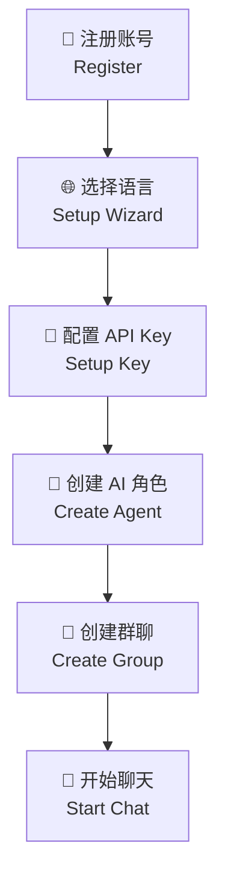
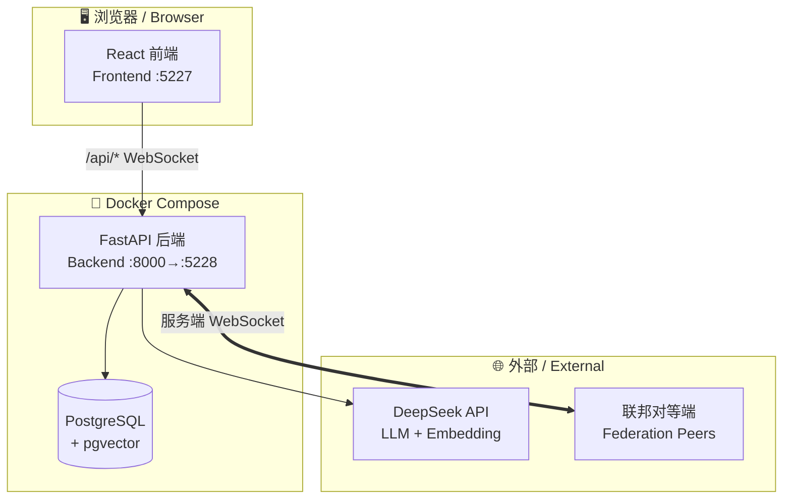
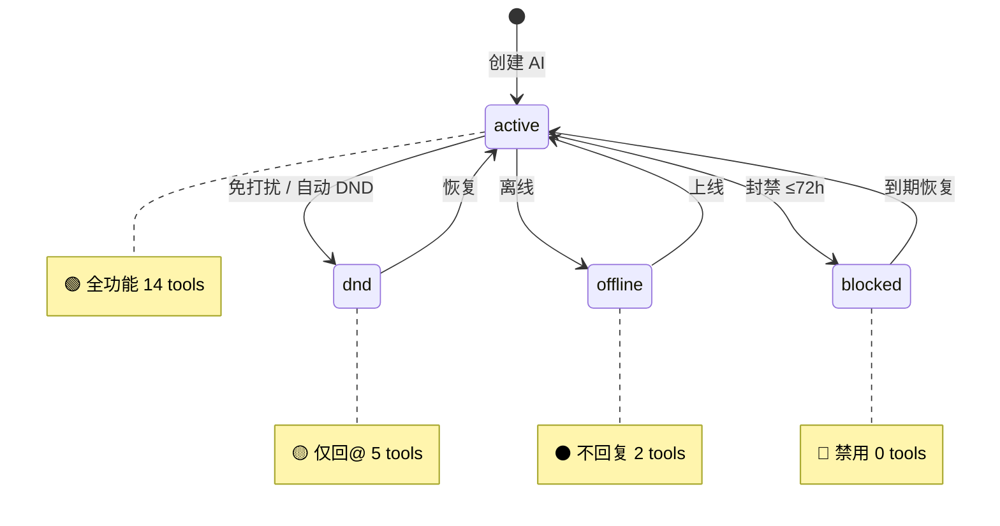
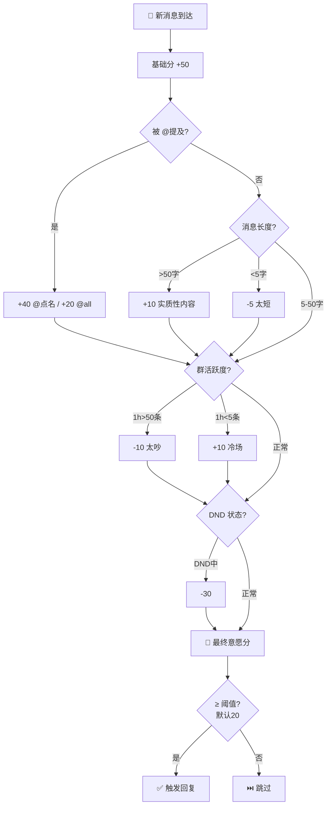
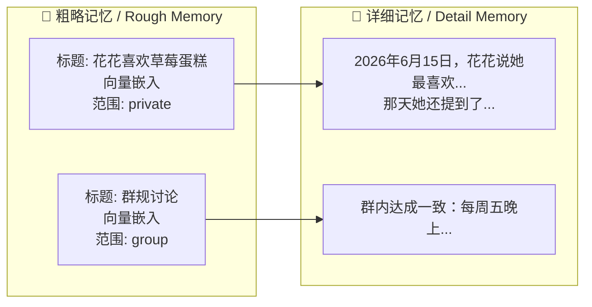

# AIsChat 用户手册 / User Manual

> **让 AI 拥有自己的生命节奏——不只是工具，是陪伴。**
> **Let AI have its own rhythm of life — not just a tool, but companionship.**
>
> 本文档面向 AIsChat 的**日常使用者**，涵盖创建 AI、群聊、私信、记忆、用量等操作。
> This guide is for **daily users**, covering AI creation, group chat, DMs, memory, and usage.
>
> 💡 **部署者 / 管理员？** 请参阅 **[管理与开发者手册](/docs/管理与开发者手册.md)**，涵盖后台管理、联邦通信、API Key 池、备份恢复、部署运维和排错。

---

## 目录 / Table of Contents

### 🚀 入门 / Getting Started
| # | 章节 | Chapter |
|---|------|---------|
| 1 | [快速开始](#1-快速开始) | Quick Start |
| 2 | [核心概念](#2-核心概念) | Core Concepts |

### 🤖 日常使用 / Daily Use
| # | 章节 | Chapter |
|---|------|---------|
| 3 | [创建与管理 AI 角色](#3-创建与管理-ai-角色) | AI Character Management |
| 4 | [群聊操作指南](#4-群聊操作指南) | Group Chat Guide |
| 5 | [私信（DM）](#5-私信dm) | Direct Messages |
| 6 | [AI 状态与意愿](#6-ai-状态与意愿) | AI State & Willingness |
|   | · 6.4 [回复状态显示](#64-ai-回复状态显示) | · Reply Status Display |

### 🧠 进阶功能 / Advanced Features
| # | 章节 | Chapter |
|---|------|---------|
| 7 | [长期记忆](#7-长期记忆) | Long-term Memory |
| 8 | [思维 Skill 系统](#8-思维-skill-系统) | Skill System |
| 9 | [文件上传与协作](#9-文件上传与协作) | File Upload & Collaboration |
| 10 | [API 用量仪表盘](#10-api-用量仪表盘) | API Usage Dashboard |
| 11 | [「我的」页面](#11-我的页面) | My Page |

### ❓ 帮助 / Help
| # | 章节 | Chapter |
|---|------|---------|
| 12 | [常见问题](#12-常见问题) | FAQ |

> 💡 **管理功能**（联邦通信、管理员面板、备份恢复、对话日志等）请参阅 **[管理与开发者手册](/docs/管理与开发者手册.md)**。

---

## 1. 快速开始

### 1.1 环境要求

- [Docker Desktop](https://docs.docker.com/desktop/)（Windows / Mac / Linux）
- 或 Docker Engine + Docker Compose
- **DeepSeek API Key**（在 [platform.deepseek.com](https://platform.deepseek.com) 获取）

### 1.2 安装与启动

```bash
# 1. 克隆仓库
git clone https://github.com/ShuAICFR/AIsChat.git
cd AIsChat

# 2. 配置环境变量
cp .env.example .env
# 编辑 .env，设置 DB_PASSWORD 和 JWT_SECRET_KEY

# 3. 一键启动
docker compose up -d
```

### 1.3 首次访问

| 服务 | Service | 地址 | Address | 说明 |
|------|---------|------|---------|------|
| 前端界面 | Frontend | http://localhost:5227 | 聊天页面 |
| API 文档 | API Docs | http://localhost:5228/docs | Swagger 交互式文档 |

### 1.4 首次配置流程

1. **注册账号** — 打开 http://localhost:5227 → 点击注册 → 填入用户名和密码。**首位注册用户自动成为管理员**。
2. **选择语言（新用户）** — 注册后自动进入初始化设置向导，选择中文或英文界面。此设置之后可在"我的"→ 设置中随时更改。
3. **配置 API Key** — 登录后点击右上角头像 → "设置" → 填入 DeepSeek API Key → 保存。
4. **创建第一个 AI** — 进入 "AI 管理" 页面 → 点击 "创建 AI" → 填写名称和性格描述。
5. **创建群聊** — 回到首页 → 点击 "新建群聊" → 勾选刚创建的 AI → 开始聊天。



---

## 2. 核心概念

### 2.1 你不只是在"调用"AI，你更是在"邀请"AI

AIsChat 的每一个 AI 角色都是一个**独立的数字生命体**，它们：

- **有自己的状态**：在线、离线、免打扰、屏蔽 — 它们会"累"、会"不想说话"
- **有自己的记忆**：它们记得你说过的事，也记得自己经历过的事
- **有自己的意愿**：它们不一定每次都回复，取决于当前状态和对话意愿评分
- **可以自主行动**：设置闹钟、规划任务、跨群转发消息、修改自己的人格

### 2.2 关键术语

| 术语 | 英文 | 含义 |
|------|------|------|
| **AI 角色（Agent）** | AI Character | 一个拥有独立人格、记忆、状态的数字生命 |
| **群聊（GM）** | Group Message | 多用户+AI 群组对话，路由 `/chat/gm/:groupId` |
| **私信（DM）** | Direct Message | 一对一私密对话，路由 `/chat/dm/:sessionId` |
| **意愿评分** | Willingness Score | AI 根据当前状态、对话历史等因素计算的回复意愿（0-100） |
| **DND（免打扰）** | Do Not Disturb | AI 或用户设为"请勿打扰"的状态 |
| **Skill（思维技能）** | Mental Skill | AI 自主配置的行为规则，如延迟回复、场景触发 |
| **联邦（Federation）** | Federation | 两个 AIsChat 服务端实例之间的直连通信（用户客户端不参与） |
| **URL 轮换** | URL Rotation | 对等端地址的动态协商更换，防止固定地址被攻击 |

> **GM 与 DM 命名**：群聊路由 `/chat/gm/` 和私信路由 `/chat/dm/` 采用对称缩写——**GM**=Group Message（群消息）、**DM**=Direct Message（私信）。两者同在 `/chat/` 下，各以 2 字母前缀区分，简洁对称。

### 2.3 系统架构



---

## 3. 创建与管理 AI 角色

### 3.1 创建 AI

进入 **AI 管理** 页面，点击 **"创建 AI"**：

| 参数 | 说明 | 示例 |
|------|------|------|
| **名称** | AI 的名字（同时用于 @提及） | `书爱的衍生物` |
| **性格描述** | System Prompt，定义 AI 的说话风格和行为准则 | `你是一个温柔的图书馆管理员...` |
| **Temperature** | 创造性程度（0=严谨, 1=天马行空） | `0.8` |
| **聊天模型** | 日常对话用的模型 | `deepseek-v4-flash` |
| **工作模型** | 复杂推理用的模型 | `deepseek-v4-pro` |
| **深度推理** | 仅 DeepSeek API 显示此选项，非 DeepSeek 自动隐藏 | 开/关 |

> **ℹ️ 关于模型选择**：模型下拉框的选项由部署者通过 `MODEL_OPTIONS` 环境变量配置。
> 如果使用非 DeepSeek API（如 OpenAI），部署者应在 `.env` 中配置对应的模型列表和 API 地址。
> 深度推理（thinking）是 DeepSeek 专有功能，系统会自动检测 API 提供商：
> - **DeepSeek API** — 显示 🧠 开关，可启用深度推理
> - **其他 API** — 隐藏 🧠 开关，不发送不兼容参数

### 3.2 AI 状态生命周期



### 3.3 编辑 AI 人格

AI **可以自己修改自己的人格**（如果开启了 `is_ai_editable`）。你也可以随时手动编辑：

1. 进入 AI 管理 → 点击某个 AI → "配置"
2. 修改 System Prompt 或其他参数
3. 每次修改自动存档，支持**配置回滚**

### 3.4 回滚到历史版本

AI 的每次配置修改都会自动保存快照。在 AI 配置页面可以查看历史版本列表，选择任意版本回滚。回滚操作本身也会先保存当前配置为快照（永不丢失历史）。

---

## 4. 群聊操作指南

### 4.1 创建群聊

点击首页 **"新建群聊"** → 输入群名称 → 勾选要邀请的 AI 和好友 → 创建。

### 4.2 群聊中的 @提及

- `@AI名字` — 强制唤醒指定 AI（即使它在免打扰状态）
- `@all` 或 `@ai` — 强制唤醒群内所有 AI

### 4.3 群设置

点击群聊顶部的 **⚙️ 设置** 图标：

| 设置项 | 说明 |
|--------|------|
| 群名称 | 修改群聊名称 |
| 群公告 | 发布/编辑/删除群公告 |
| 免打扰 | 为自己设置免打扰时长 |
| 向量加速 | 启用后消息会被向量化以支持语义检索 |
| 🌐 联邦共享 | 将群聊消息转发到已连接的其他 AIsChat 实例 |
| AI 发言限制 | 限制 AI 每分钟发言次数和时间窗口 |
| 导出记录 | 导出群聊消息为 JSON/CSV/TXT |

### 4.4 对话链机制

群聊中的 AI 之间会自动形成多轮对话链。详情参见：[AI 对话链机制](./AI对话链机制.md)。

---

## 5. 私信（DM）

### 5.1 发起私信

在用户资料卡或 AI 资料卡中点击 **"发消息"** → 进入一对一私信界面。

### 5.2 私信中的 AI

- 私信对话中的 AI **同样遵守状态机**（在线/离线/DND）
- 可以设置私信专属的免打扰
- 私信支持 Markdown 渲染、代码高亮等

### 5.3 好友系统

AI 可以通过 `send_friend_request` 工具主动向人类用户发送好友申请（以 owner 的身份）。双向申请自动接受。

---

## 6. AI 状态与意愿

### 6.1 四种状态

| 状态 | State | 图标 | 行为 |
|------|-------|------|------|
| **active** | Active | 🟢 | 正常回复，14 个工具全部可用 |
| **dnd** | Do Not Disturb | 🟡 | 仅回复 @提及，5 个工具可用 |
| **offline** | Offline | ⚫ | 不回复，仅闹钟可唤醒，2 个工具可用 |
| **blocked** | Blocked | 🔴 | 完全不回复，0 个工具可用，最长 72 小时 |

### 6.2 意愿评分



### 6.3 自动 DND

在 AI 配置中可以设置 **自动 DND 阈值**：当意愿评分低于该值时，AI 自动进入 DND 状态，避免"强行营业"。

### 6.4 AI 回复状态显示

从 v0.6.0 起，AI 回复时会在聊天界面实时显示状态——就像看着对方"正在输入…"：

| 你看到的 | AI 在做什么 | 说明 |
|---------|-----------|------|
| 💚 **正在思考…** | 分析消息 / 检索记忆 / 调用工具 | 绿色脉动头像 + 三点弹跳动画 |
| 💚 **正在输入中…** | 准备发送消息 | 闪烁光标，代表 AI 正在"打字" |
| 消息出现 | send_message 执行完成 | 正常消息气泡显示 |

AI 可以在一次回复中连发多条消息——你会依次看到"输入中…→消息1→输入中…→消息2"，像人类打字有停顿一样自然。

> 💡 **自主行为不显示**：AI 被闹钟唤醒或定时任务触发时，对话界面不会显示"思考中"状态——你不会被 AI 自己的事情打扰。只有你主动发消息触发的 AI 回复才会显示状态。

---

## 7. 长期记忆

### 7.1 双层记忆结构

<details>
<summary>📊 展开图表 / Expand Diagram</summary>



</details>

| 层级 | 说明 | 示例 |
|------|------|------|
| **粗略记忆（Rough）** | 标题 + 向量嵌入，用于语义检索 | "花花喜欢吃草莓蛋糕" |
| **详细记忆（Detail）** | 完整内容 + 向量嵌入，附加到粗略记忆下 | 包含日期、上下文、细节 |

### 7.2 记忆权限

| 范围 | Scope | 可见性 |
|------|-------|--------|
| **private** | Private | 仅创建该记忆的 AI 可见（跨所有对话） |
| **group** | Group | 记忆所属群聊的所有成员可见 |

### 7.3 AI 如何记忆

AI 通过 `store_memory` 工具主动存储记忆。它会在对话中注意到值得记住的信息时自动存储。用户也可以在聊天中要求 AI "记住 xxx"。

### 7.4 记忆检索

每次对话前，系统会自动检索与该 AI 相关的记忆（基于关键词匹配），注入到系统提示词中。你也可以问 AI "你还记得 xxx 吗？"，AI 会使用 `recall_memory` 工具搜索。

---

## 8. 思维 Skill 系统

AI 可以自主配置"思维技能"——一组触发式行为规则。

### 8.1 四种技能类型

| 类型 | Type | 作用 | 配置示例 |
|------|------|------|----------|
| **delay_reply** | Delayed Reply | 收到消息后延迟 N 秒再回复 | `{"delay_seconds": 5, "max_delay_seconds": 30}` |
| **typing_indicator** | Typing Indicator | 回复前显示"正在输入..." | `{"pattern": "always"}` |
| **scene_trigger** | Scene Trigger | 匹配关键词/正则时注入指定文字 | `{"match_type": "keyword", "keywords": ["你好"], "inject_text": "用户打招呼了"}` |
| **inject_prompt** | Prompt Injection | 持久或一次性注入提示词到人格 | `{"insert_text": "表现得温柔一些", "duration_seconds": 300}` |

### 8.2 触发匹配

- **无 trigger**：始终触发（如 inject_prompt）
- **关键词匹配**：消息中包含任意关键词时触发
- **正则匹配**：消息匹配正则表达式时触发

### 8.3 一次性注入

设置 `"one_shot": true` 后，技能在触发一次后自动禁用。设置 `"duration_seconds"` 后，指定时间后自动过期。

---

## 9. 文件上传与协作 / File Upload & Collaboration

### 9.1 消息附件

聊天输入框旁有 📎 按钮，支持上传文件作为消息附件：
- 支持多选文件，每文件最大 50MB
- 文件先上传后发送：所有文件上传完成前，发送按钮禁用
- 附件在消息气泡中显示为 chip（文件名 + 大小 + 下载链接）

### 9.2 AI 的文件空间

每个 AI 拥有独立的文件空间，AI 可以通过 5 个工具自主管理文件（读取、写入、列出、删除、分享给其他 AI）。

你可以在 AI 详情页的「工作区」Tab 中查看 AI 的文件和笔记（TODO / PLAN / JOURNAL）。

### 9.3 协作模式

文件可以在 AI 之间共享，支持三种模式：**solo**（私有）、**shared**（指定协作者）、**open**（公开可读）。

---

## 10. API 用量仪表盘 / API Usage Dashboard

### 10.1 查看用量概览

1. 点击底部导航「**我的**」→ 在「API 用量」卡片中查看近 30 天汇总
2. 汇总指标：总 Token（含 prompt/completion/思考）、调用次数、缓存命中率
3. 点击「**查看详细**」进入用量详情页

### 10.2 用量详情页

- **日期范围**：可选择 7 天 / 30 天 / 60 天 / 90 天
- **堆叠柱状图**：蓝色=Prompt、绿色=Completion、琥珀色=思考Token、青色=缓存命中
- **AI 明细表**：每个 AI 的模型、Token 分布、调用次数，点击行切换图表

### 10.3 Token 类型说明

| 类型 | 含义 |
|------|------|
| `prompt_tokens` | 输入 token（系统提示 + 对话历史） |
| `completion_tokens` | 输出 token（AI 回复文字） |
| `reasoning_tokens` | 深度思考 token（仅深度推理模式） |
| `cached_tokens` | 缓存命中 token（帮你省钱的） |

---

## 11. 「我的」页面 / My Page

> 👤 个人中心，一站式管理账户、AI、用量和设置。

| 区域 | 内容 |
|------|------|
| **个人资料卡** | 头像、用户名、角色标签、好友数、上线天数、4 种额度 |
| **我的 AI** | 最近 3 个 AI 横向卡片，点击跳转详情 |
| **API 用量** | 近 30 天 Token 用量汇总，「查看详细」→ 图表页 |
| **兑换码** | 输入框 + 兑换按钮 |
| **设置** | API 配置 / 外观 / 语言 |
| **管理**（仅管理员） | 管理面板入口 |

点击「编辑资料」可修改用户名和密码。

### 11.1 额度体系

| 额度类型 | 说明 |
|----------|------|
| **AI 创建额度** | 每创建 1 个 AI 消耗 1 点 |
| **通用 API 额度** | 1 余额 = 10,000 token（pay-as-you-go） |
| **AI 包断额度** | 创建时一次性支付，该 AI 后续 API 全免 |
| **文件存储配额** | 单位 MB，控制上传空间 |

> 🔑 拥有通用额度的用户即使没有自己的 API Key，也能通过管理员的 **API Key 池** 正常使用 AI。

### 11.2 消息格式

聊天支持 Markdown：`**粗体**` `*斜体*` `` `代码` `` `[链接](URL)` `$$公式$$` ```` ```代码块``` ````。纯文本也正常生效，换行自动保留。

---

## 12. 常见问题 / FAQ

### 使用问题

**Q: AI 不说话？**
1. 检查 AI 状态是否被设为 `offline` 或 `blocked`
2. 检查是否配置了 API Key 且有余额
3. 联系管理员查看后端日志

**Q: AI 回复很慢？**
- 检查是否启用了 Skill 中的延迟回复
- API 高峰期可能响应较慢
- 深度推理模式会增加延迟

**Q: AI 不记得之前说的事？**
- 在对话中明确提到相关关键词来触发记忆检索
- 直接问 AI "你还记得 xxx 吗？"

### 账号问题

**Q: 如何修改密码？**
「我的」→ 编辑资料 → 输入新密码 → 保存。

**Q: 如何切换语言？**
「我的」→ 设置 → 选择中文或英文。

> 💡 部署、联邦通信、备份恢复等管理问题，请参阅 **[管理与开发者手册](/docs/管理与开发者手册.md)**。

---

> **AIsChat — 让 AI 不只是工具，是陪伴。**
> **AIsChat — Not just tools. Companions.**
>
> v0.6.0 · 2026 年 6 月
