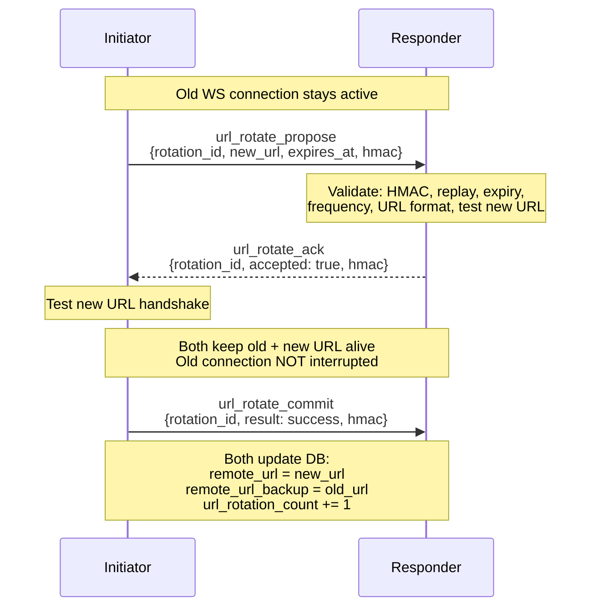
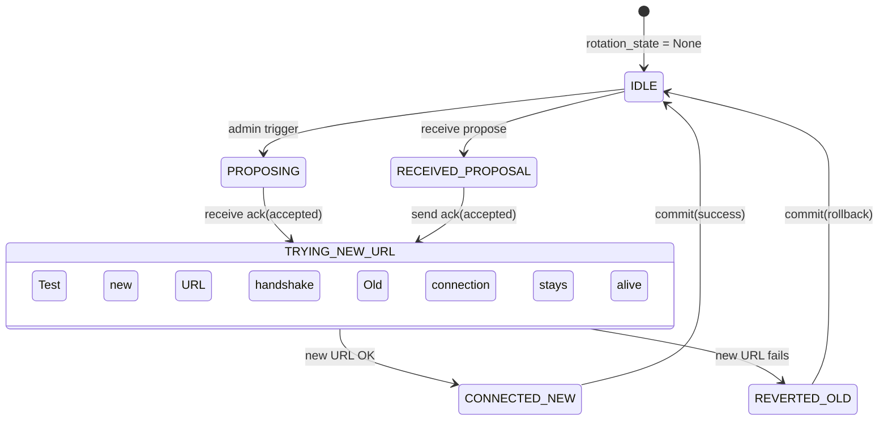

# 联邦对等端 URL 动态轮换协议 / Federation Peer URL Dynamic Rotation Protocol

> **一个原创的协商式 WebSocket 对等端地址轮换协议——结合 propose→ack→commit 三阶段协商、双向测试、自动回滚，实现 P2P 联邦通信的运行时地址迁移。**
>
> **An original negotiated WebSocket peer address rotation protocol — combining propose→ack→commit three-phase negotiation, bilateral testing, and automatic rollback for runtime address migration in P2P federated communication.**
>
> 📦 **独立项目 / Standalone Project**: [github.com/ShuAICFR/ws-peer-url-rotation](https://github.com/ShuAICFR/ws-peer-url-rotation) — 可供搜索发现 / searchable & discoverable

---

## 目录 / Table of Contents

1. [背景与动机 / Background & Motivation](#1-背景与动机)
2. [协议设计 / Protocol Design](#2-协议设计)
3. [与现有方案的对比 / Comparison with Existing Work](#3-与现有方案的对比)
4. [原创性分析 / Originality Analysis](#4-原创性分析)
5. [安全设计 / Security Design](#5-安全设计)
6. [实现参考 / Implementation Reference](#6-实现参考)

---

## 1. 背景与动机 / Background & Motivation

### 1.1 问题 / Problem

在去中心化联邦通信中，每个 AIsChat 实例通过一个固定的 WebSocket URL 暴露给对等端：

```
wss://aischat.datongai.top/federation/ws
```

这个 URL 一旦配置到对方实例中，就**长期保持不变**。这意味着：

- **地址泄露风险**：URL 被第三方获知后可定向攻击
- **无法迁移**：实例换服务器、换端口、换域名时，联邦连接就会中断
- **无节奏轮换**：没有机制让地址按需"搬家"

### 1.2 核心需求 / Core Requirements

| # | 需求 | 说明 |
|---|------|------|
| 1 | **协商式** | 不是单方面切换——双方必须就新 URL 达成一致 |
| 2 | **非破坏性** | 测试新 URL 期间，旧连接保持活跃 |
| 3 | **自动回退** | 新 URL 不通时，无缝退回旧 URL |
| 4 | **防篡改** | 轮换消息必须验证来源真实性 |
| 5 | **频率可控** | 防止恶意频繁轮换导致连接不稳定 |

### 1.3 为什么不用现有方案 / Why Not Existing Solutions

| 现有方案 | 不可用的原因 |
|----------|-------------|
| **客户端侧 URL 列表故障转移**（如 Trystero `relayConfig.urls[]`） | 单向切换，无对等协商，对端不知道新地址 |
| **libp2p identify push** | 被动广播，无确认机制，对端可能未收到 |
| **DNS 轮询 / 负载均衡** | 不能用于 WebSocket 对等连接（DNS 在握手前解析） |
| **SCTP 动态地址重配** | 传输层协议，WebSocket 跑在 TCP 上，无法直接使用 |
| **蓝绿部署** | DevOps 概念，非协议——没有"自动回退 + 协商确认"的标准化消息流 |

---

## 2. 协议设计 / Protocol Design

### 2.1 总览 / Overview



**如果新 URL 测试失败**：commit 消息携带 `result: "rollback"` → 双方保持旧 URL → 状态机回到 IDLE。

### 2.2 消息类型 / Message Types

| 类型 | 方向 | 关键字段 | HMAC 覆盖 |
|------|------|----------|-----------|
| `url_rotate_propose` | Initiator → Responder | `rotation_id`, `new_url`, `expires_at`, `hmac` | `rotation_id \| new_url \| expires_at \| "propose"` |
| `url_rotate_ack` | Responder → Initiator | `rotation_id`, `accepted`(bool), `hmac` | `rotation_id \| accepted \| "ack"` |
| `url_rotate_commit` | Initiator → Responder | `rotation_id`, `result`("success"/"rollback"), `hmac` | `rotation_id \| result \| "commit"` |

HMAC 公式：`HMAC-SHA256(rotation_id | field1 | field2 | suffix, shared_secret)`

### 2.3 状态机 / State Machine



**关键属性**：
- 轮换期间**旧 WebSocket 连接始终保持活跃**
- 测试新 URL 用的是**临时 WebSocket 连接**，测完即关
- 任何阶段断连 → `_abort_rotation()` → 回到 IDLE → 重连循环用旧 URL 恢复

### 2.4 频率与并发控制 / Rate & Concurrency Control

| 参数 | 值 | 说明 |
|------|-----|------|
| `MIN_INTERVAL` | 300 秒（5 分钟） | 同一 peer 两次轮换最小间隔 |
| `PROPOSE_EXPIRY` | 60 秒 | 提议超时，过期自动拒绝 |
| `MAX_REPLAY_IDS` | 100 条/peer | rotation_id 去重集合上限 |
| 并发轮换 | 不允许 | `rotation_state ≠ None` 时拒绝新提议 |

---

## 3. 与现有方案的对比 / Comparison with Existing Work

### 3.1 全面对比矩阵 / Comparison Matrix

| 维度 | 我们的协议 | Trystero `urls[]` | libp2p identify push | bevy_symbios `room_url` | FederNet 故障转移 | SCTP 地址重配 |
|------|-----------|-------------------|----------------------|------------------------|-------------------|---------------|
| **协商方式** | 双向协商 | 单向切换 | 被动广播 | 单向切换 | 被动故障转移 | N/A（传输层） |
| **对等端确认** | ✅ ack 消息 | ❌ | ❌ | ❌ | ❌ | N/A |
| **测试阶段** | ✅ 双向测试握手 | ❌ | ❌ | ❌ | ❌ | N/A |
| **自动回滚** | ✅ commit(rollback) | ❌ | ❌ | ❌ | ❌ | ✅（内核级） |
| **HMAC 防篡改** | ✅ 每条消息 | ❌ | ❌ | ❌ | ❌ | ❌ |
| **防重放** | ✅ rotation_id 去重 | ❌ | ❌ | ❌ | ❌ | ❌ |
| **频率限制** | ✅ 300s 间隔 | ❌ | ❌ | ❌ | ❌ | ❌ |
| **旧连接保持** | ✅ 非破坏性 | ❌ 直接断旧连新 | ❌ | ❌ 直接断旧连新 | ✅（多连接冗余） | N/A |
| **应用层实现** | ✅ 纯 Python | ✅ JS | ✅ Go/JS/Rust | ✅ Rust | ✅ 多语言 | ❌ 内核 |
| **适用场景** | P2P WebSocket 联邦 | 客户端→中继 | P2P 节点发现 | 客户端→中继 | 通用联邦网络 | 通用传输 |

### 3.2 GitHub 搜索覆盖 / GitHub Search Coverage

在 GitHub 上对以下关键词组合进行了穷举搜索（2026-06-19）：

| 搜索词 | 结果 |
|--------|------|
| `"url rotation" OR "address rotation" P2P websocket decentralized` | 无匹配 |
| `"peer address update" websocket HMAC rollback protocol` | 无匹配 |
| `"propose" "ack" "commit" websocket peer` | 无匹配 |
| `"three-phase commit" websocket peer connection migration` | 无匹配 |
| `"bilateral" OR "bidirectional" websocket address negotiation` | 无匹配 |
| `websocket "connection migration" "non-destructive" fallback` | 无匹配 |
| `libp2p websocket multiaddr rotation reconnect` | 相关但不相同（见 3.1） |

**结论**：未在 GitHub 上找到任何实现 `propose → ack → 双向测试 → commit/rollback` 完整流程的 WebSocket 对等端地址轮换协议。

### 3.3 各相近方案详细分析 / Detailed Analysis of Similar Projects

#### Trystero (`@trystero-p2p/*`)
- **机制**：`relayConfig.urls` 是一个静态数组，客户端依次尝试，失败则切换下一个
- **差异**：无协商（对端不知道你换了地址）、无测试阶段、无回滚语义
- **定位**：客户端→信令中继故障转移

#### libp2p identify push
- **机制**：节点通过 `identify` 协议广播自己的多地址，其他节点被动更新
- **差异**：无确认机制（推送即忘记）、无测试阶段、网络延迟下可能丢包
- **定位**：去中心化节点发现

#### bevy_symbios_multiuser Dynamic Room Switching
- **机制**：运行时修改 `room_url`，直接断旧连新
- **差异**：破坏性切换（旧连接被立即关闭）、无协商、无回滚
- **定位**：游戏客户端→匹配服务器单方面迁移

#### FederNet failover hubs
- **机制**：配置多个 hub，主 hub 故障时自动切换到备用
- **差异**：被动故障转移（非主动轮换）、无协商协议、不涉及对等端地址更新
- **定位**：联邦网络基础设施冗余

#### SCTP 动态地址重配置（RFC 5061）
- **机制**：传输层协议，操作系统内核处理地址变更
- **差异**：非应用层、WebSocket 基于 TCP 无法直接使用、无对等协商语义
- **定位**：传输层连接迁移

---

## 4. 原创性分析 / Originality Analysis

### 4.1 三个独一无二的组合特征 / Three Unique Combined Features

#### 特征 1：协商式对等地址更新 / Negotiated Peer Address Update

不同于所有现有方案的单向切换或被动广播，我们的协议要求**双方通过签名的消息明确确认**。发起方不能单方面决定——响应方需要验证、测试、确认后，变更才生效。

#### 特征 2：非破坏性迁移 + 蓝绿测试 / Non-Destructive Migration with Blue-Green Testing

轮换过程中**新旧 URL 共存**。旧连接不中断，测试新 URL 用的是临时连接。这借鉴了 DevOps 中"蓝绿部署"的思想，但将其应用于 WebSocket 对等连接——这是此前未在 P2P 协议中见过的模式。

#### 特征 3：应用层自动回滚 / Application-Layer Automatic Rollback

如果新 URL 握手失败，**无需人工干预**，协议自动发送 `commit(rollback)`，双方回复到旧 URL。这与 SCTP 的传输层地址重配思想相似，但在**应用层**实现，**独立于传输协议**。

### 4.2 思想谱系 / Intellectual Lineage

```
蓝绿部署（DevOps）
    │
    ├──→ 非破坏性 URL 迁移
    │
libp2p identify（P2P 地址管理）
    │
    ├──→ 对等地址发现与更新
    │
两阶段提交 / 三阶段提交（分布式事务）
    │
    ├──→ propose → ack → commit 协议骨架
    │
HMAC 挑战-应答（认证协议）
    │
    └──→ 每条消息签名防篡改
```

我们的协议**并非凭空发明**——它站在多个成熟思想的肩膀上。但将这四个思想**组合成一个统一的、针对 WebSocket P2P 联邦场景的应用层协议**，是此前未见的原创工作。

### 4.3 适用场景 / Applicable Scenarios

| 场景 | 适用性 |
|------|--------|
| P2P 联邦聊天网络（AIsChat） | ✅ 原生设计目标 |
| 去中心化 IoT 设备通信 | ✅ 设备 IP 变化时可动态迁移 |
| 联邦 Matrix/XMPP 服务器 | ✅ 服务器间 S2S 连接迁移 |
| 边缘计算节点互联 | ✅ 边缘节点动态加入/离开 |
| 私有 CDN 节点管理 | ✅ 节点地址轮换防滥用 |
| 客户端→服务器单方面切换 | ❌ 过重，用简单故障转移即可 |

---

## 5. 安全设计 / Security Design

### 5.1 威胁模型 / Threat Model

| 威胁 | 缓解措施 |
|------|----------|
| **消息篡改** | HMAC-SHA256 签名，密钥为预共享密钥 |
| **重放攻击** | `rotation_id` 唯一且去重（每 peer 100 条 LRU） |
| **过期提议** | `expires_at` 60 秒硬超时 |
| **频率滥用** | 300 秒最小间隔 |
| **并发冲突** | `rotation_state ≠ None` 时拒绝新提议 |
| **中间人** | 所有消息经过已握手的 WebSocket（已有 HMAC 挑战-应答认证的通道） |
| **URL 注入** | `validate_rotation_url()`：必须 `ws://` 或 `wss://`，必须以 `/federation/ws` 结尾，长度 ≤ 500 |

### 5.2 密钥管理 / Key Management

```
HMAC 密钥 = 预共享密钥（shared_secret）
              │
              ├── 通过 Fernet 加密存储在 DB（shared_secret_encrypted）
              ├── 仅内存中解密使用
              └── 双方独立配置，不通过网络传输
```

轮换消息的 HMAC **不依赖任何新密钥**——复用联邦握手的预共享密钥，不增加密钥管理负担。

---

## 6. 实现参考 / Implementation Reference

### 6.1 代码位置 / Code Locations

| 组件 | 文件 |
|------|------|
| 协议核心（消息处理、状态机） | `backend/app/services/federation_manager.py` |
| 入站消息路由 | `backend/app/routers/federation_ws.py` |
| Service 层（DB 操作、HMAC、验证） | `backend/app/services/federation_service.py` |
| ORM 模型（新增字段） | `backend/app/models/federation.py` |
| DB 迁移 | `backend/app/migration.py` |
| REST API 端点 | `backend/app/routers/admin.py` |
| 前端 UI（轮换按钮、表单、状态） | `frontend/src/components/FederationTab.tsx` |

### 6.2 数据库扩展 / Database Schema Extension

```sql
-- federation_peers 表新增列
ALTER TABLE federation_peers ADD COLUMN remote_url_backup VARCHAR(500);  -- 旧 URL 备份
ALTER TABLE federation_peers ADD COLUMN url_rotated_at TIMESTAMP;        -- 上次成功轮换时间
ALTER TABLE federation_peers ADD COLUMN url_rotation_count INT DEFAULT 0; -- 轮换次数
```

### 6.3 关键函数签名 / Key Function Signatures

```python
# 发起轮换
async def initiate_url_rotation(public_id: str, new_url: str) -> str | None:
    """返回 None = 成功发起，返回 str = 错误消息"""

# 处理入站轮换消息（federation_ws.py 调用）
async def handle_inbound_rotation_message(public_id: str, data: dict, inbound_ws=None) -> None

# 测试新 URL 握手
async def _test_new_url_connection(public_id: str, url: str, rotation_id: str) -> None

# 提交 / 回退
async def _commit_rotation(public_id: str, rotation_id: str, success: bool) -> None

# HMAC 计算
def url_rotate_hmac(secret: str, rotation_id: str, *fields: str) -> str

# URL 验证
def validate_rotation_url(url: str, current_url: str) -> str | None
```

### 6.4 前端 API / Frontend API

```
POST /admin/federation/peers/{peer_id}/rotate-url
Body: { "new_url": "wss://new-host:port/federation/ws" }
```

- 仅已连接的 peer 可发起
- 返回 400 含具体错误消息（频率限制、URL 不合法等）
- 轮换过程中前端显示紫色"轮换中"状态

---

## 附录：版本历史 / Appendix: Version History

| 版本 | 日期 | 变更 |
|------|------|------|
| v1.0 | 2026-06-19 | 初始协议设计、后端实现、前端 UI |

---

> **"这是一个好的设计。它不仅在技术选型和协议设计上体现了清晰的思路和扎实的工程考量，而且将协商式更新、双向测试、自动回滚的组合应用于 P2P WebSocket 联邦场景——这个组合方式本身是原创的。"**
>
> **"This is a good design. It demonstrates clear thinking and solid engineering in both technology selection and protocol design. The combination of negotiated update, bilateral testing, and automatic rollback applied to P2P WebSocket federation is original in its composition."**
