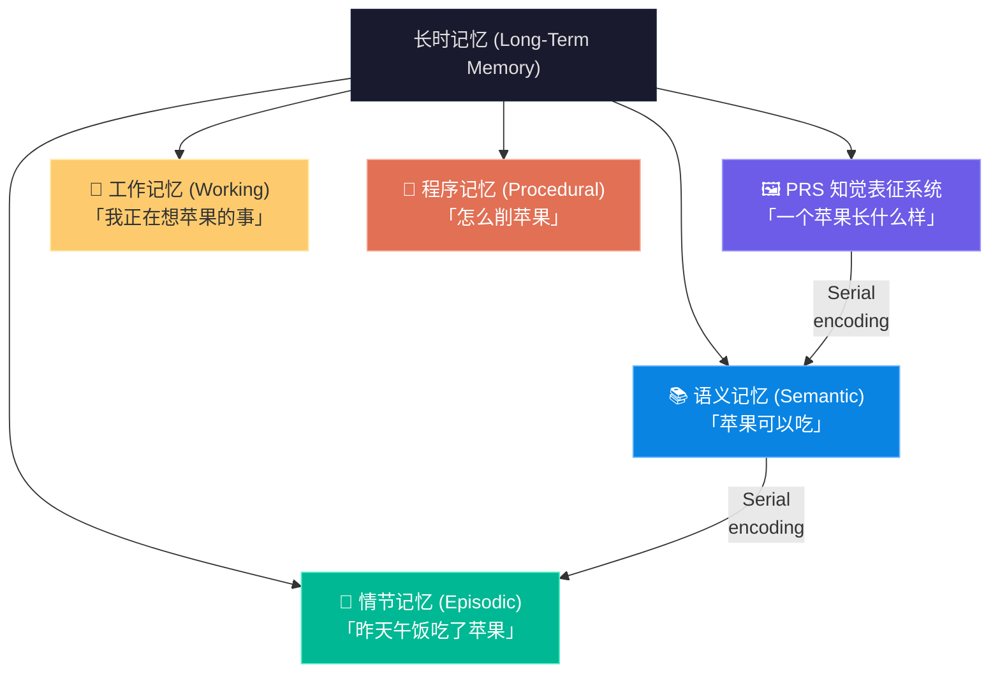
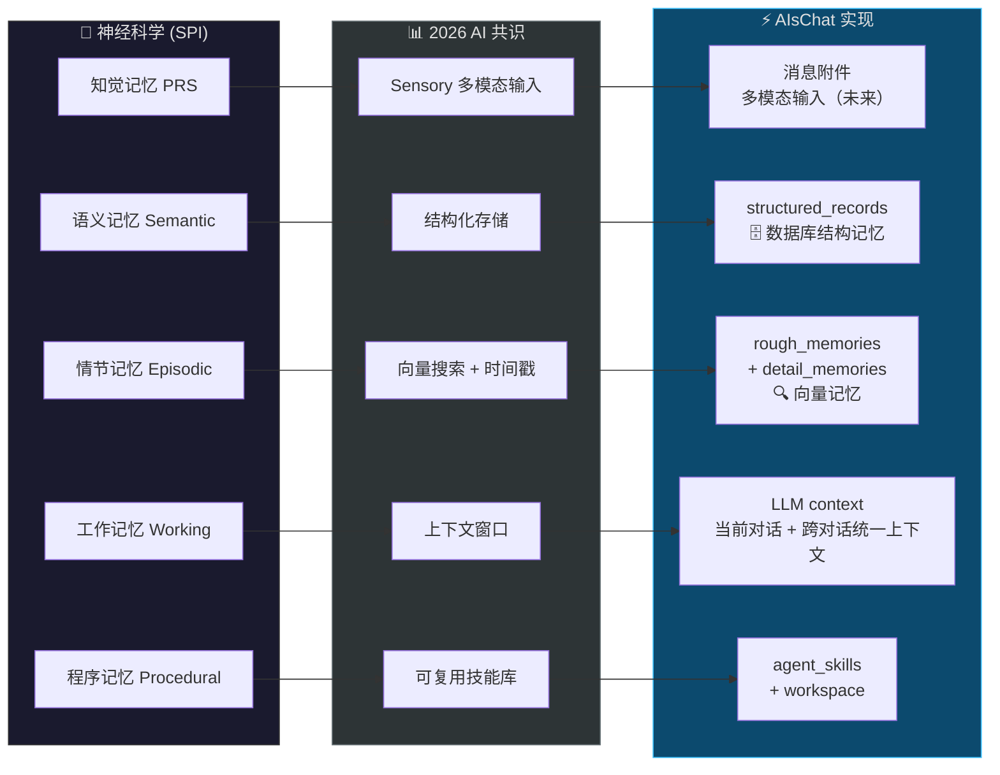
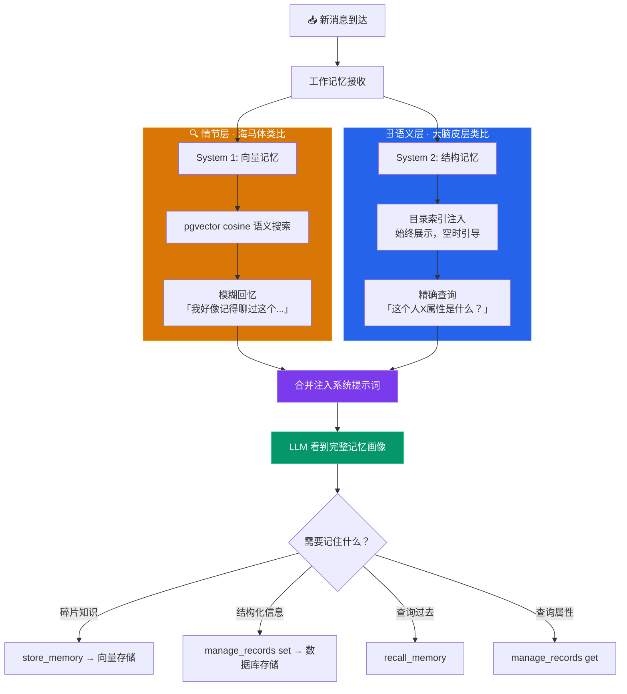
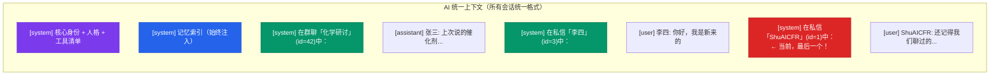
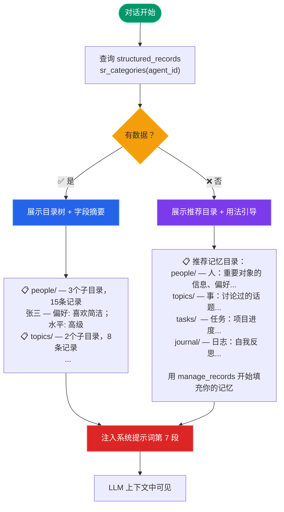
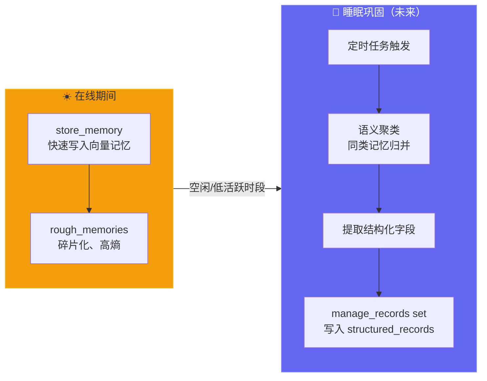

# AIsChat 记忆架构设计

## 理论基础

### 人脑记忆的神经科学框架 (Tulving SPI 模型, 1995)

Endel Tulving 的 SPI (Serial-Parallel-Independent) 模型是认知神经科学关于记忆系统的主流理论，已得到脑成像研究的广泛验证。

**五大记忆系统**：



**SPI 三原则**：
- **Serial encoding** (串行编码)：信息流 PRS → 语义 → 情节，层层依赖
- **Parallel storage** (并行存储)：每个系统独立存储，互不替代
- **Independent retrieval** (独立提取)：提取情节记忆和语义记忆走不同通路

### 2024-2025 神经科学关键发现

1. **海马-皮层互动即 RAG** (Spens & Burgess, Nature Human Behaviour, 2024)
   > 海马 = 检索器（取相关情节片段），皮层 = 生成器（重建完整记忆）。
   > 与 LLM 的 RAG 架构完全一致。

2. **巩固不意味海马退出** (Trends in Cognitive Sciences, 2025)
   > 记忆巩固不是从海马单向"搬运"到皮层，而是双向互动过程。
   > 海马永远参与，不会完全退出。

3. **语义化可逆** (重新激活海马参与)
   > 去甲肾上腺素能重新激活已"语义化"的海马痕迹，
   > 看似丢失的细节实际上可以被唤醒。

### AI 记忆架构 2026 综述

四篇 2026 年顶级综述论文的核心共识 (arXiv 2602.06052, 2603.07670, 2605.06716, 2602.05665)：

| 记忆层次 | 实现方式 | 代表系统 |
|----------|----------|----------|
| Working Memory | LLM 上下文窗口 | 全部 |
| Episodic | 向量搜索 + 时间戳 | MemGPT, Zep |
| Semantic | 知识图谱 / 结构化存储 | Zep (Graphiti), SCG-MEM |
| Procedural | 可复用技能库 | Voyager |

关键趋势：
- 区分"存"（Storage）、"反思"（Reflection）、"经验"（Experience）三个进化阶段
- Graph-based memory 成为主流（支持关系依赖、时间推理、层次组织）
- 离线巩固（offline consolidation）——分离快速会话内获取和慢速跨会话巩固

---

## AIsChat 双重记忆架构

### 映射关系



```
神经科学 (SPI)  →  2026 AI 共识  →  AIsChat 实现
─────────────────────────────────────────────────
知觉记忆 (PRS)   →  Sensory        →  消息附件 / 多模态输入（未来）
语义记忆 (Semantic) → 结构化存储    →  structured_records（数据库）
情节记忆 (Episodic) → 向量搜索      →  rough_memories + detail_memories
工作记忆 (Working)  → 上下文窗口    →  LLM context（当前 + 跨对话）
程序记忆 (Procedural) → 技能        →  agent_skills + workspace
```

### 双系统协同工作流



### System 1: 向量记忆 (情节层)

- **表**: `rough_memories` (标题+向量) + `detail_memories` (内容+向量)
- **查询**: pgvector cosine distance 语义搜索
- **工具**: `store_memory` / `recall_memory`
- **用途**: "我记不记得这个事实？"、"那次发生了什么？"
- **特征**: 模糊召回、语义关联、适合碎片化知识

### System 2: 结构记忆 (语义层)

- **表**: `structured_records` (agent_id + category + sub_key + field → value)
- **查询**: 精确 key 查找，目录层级遍历
- **工具**: `manage_records` (set/get/list/summary/categories/delete)
- **用途**: "学生 1 的有机化学水平如何？"、"项目 X 的进度是什么？"
- **特征**: 精确存取、百万级无压力、支持目录浏览

### 统一上下文 (工作记忆层)

> v1.1.0 重新设计：统一标题格式 + 上下文压缩。详见 [`AI对话链机制.md §2.4`](./AI对话链机制.md#24-统一上下文--unified-context)。



- 数字生命档/沉浸档/共振 AI 的上下文自动包含所有活跃对话的最新消息
- 格式: `"在群聊「XXX」(id=N)中：消息"` / `"在私信「XXX」(id=N)中：消息"` —— 所有会话统一
- 当前会话标题**始终在最后**——位置即语义，无需标记
- v1.1.0: 上下文压缩保缓存命中率，旧消息稳定摘要化
- 聊天档 AI 不启用（保持单会话隔离）
- 通用/半通用 AI 按 trigger_user_id 过滤（防隐私泄露）

### 记忆索引注入



AI 系统提示词始终包含记忆索引（即时空也展示推荐目录）：
- 已有数据：展示目录树 + 字段摘要
- 空目录：展示推荐 category + 用法示例
- 引导 AI 按通用框架（people/topics/tasks/journal）填充经验

**核心原则**：像人脑先天分区一样——婴儿大脑虽然知识为空，但海马体和皮层结构已就位，等待经验填充。新 AI 不应面对"一片漆黑"的记忆系统。

### 系统提示词中的记忆位置

```mermaid
flowchart TB
    subgraph Fixed["固定段 · Cache 命中"]
        S1["1. core_identity"]
        S2["2. personality"]
        S3["3. protocol"]
        S4["4. tools"]
    end
    subgraph Dynamic["动态段"]
        S5["5. current_context<br/>当前群聊/私信基本信息（最后）"]
        S6["6. cross_context 🆕 v1.1.0<br/>统一上下文（所有会话统一标题格式）"]
        S7["7. injected_skills<br/>向量记忆召回 + Skill 引擎<br/>+ 结构记忆索引"]
    end
    S1 --> S2 --> S3 --> S4 --> S5 --> S6 --> S7

    style S1 fill:#2563eb,stroke:#1d4ed8,color:#fff
    style S6 fill:#dc2626,stroke:#b91c1c,color:#fff
    style S7 fill:#0891b2,stroke:#0e7490,color:#fff

> v1.1.0: 跨对话上下文不再作为独立消息注入（会破坏 prompt cache），而是采用统一标题格式、当前会话标题在最后的布局。同时引入上下文压缩：旧消息摘要化以保缓存稳定性。
```

---

### 未来：睡眠巩固

神经科学启发：海马 replay → 皮层巩固。
AIsChat 后续可实现定时任务，在 AI 空闲时将同类 rough_memories 合并为 structured_records 条目。


